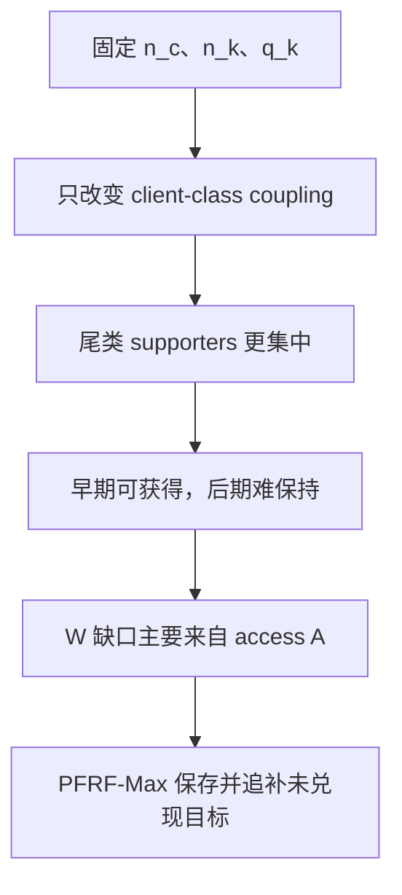

# Client-LT 论文完整故事主线：从固定边际划分到 PFRF-Max

日期：2026-09-07  
用途：代码实现、组会汇报、论文 Introduction/Method/Experiment 的统一母稿  
状态：问题设定、现象与机制结果已经完成；PFRF-Max 与 Effective SVD-FedAvg 处于实现和 pilot 验证阶段

## 0. 一句话总览

传统联邦长尾主要用全局类别频率描述类别难度，但我们发现，在完全固定类别数量、客户端容量和 FedAvg 权重后，仅将尾类证据集中到更少客户端，就会使已经形成的尾类能力在共享模型中更快退化；功能归因进一步将退化定位为 supporter 聚合 access 不足造成的持续正向刷新缺口。基于这一观察，我们提出 PFRF-Max：客户端用私有功能记忆保存历史上经普通训练实际达到过的类别功能目标，当共享模型未能兑现或后来丢失该目标时，在后续本地训练中重新施加该约束，使稀缺的 supporter 写入机会持续承担尚未完成的刷新任务。

## 1. 论文应如何定位

这篇论文最稳妥的身份是“新问题视角为主、伴随针对性方法”的工作。最重要的贡献不是再提出一种普通联邦聚合器，而是指出联邦长尾还存在一个未被全局类别频率充分描述的结构自由度，并用严格控制实验把它单独识别出来。

现有长尾描述通常从全局类别数量出发。设客户端—类别计数矩阵为 $n_{k,c}$，类别 $c$ 的全局样本数为

$$
n_c=\sum_k n_{k,c}.
$$

$n_c$ 决定类别频率长尾，但不能说明这些样本由多少客户端持有、集中在哪些客户端。后一个维度可写为

$$
p$k\mid c$=\frac{n_{k,c}}{n_c}.
$$

因此，即使两个联邦数据集具有完全相同的类别直方图，它们仍可能具有完全不同的类别证据所有权结构。本文研究的正是这个自由度。

论文开头可以用一个简单判断吸引读者：

> 对共享模型而言，“系统里有多少尾类样本”和“这些样本通过多少个客户端进入训练”不是同一件事。相同的尾类样本总量，可以由许多客户端分散持有，也可以被少数客户端集中持有；后一种结构会改变尾类在多轮联邦优化中的写入机会和保持条件。

## 2. Client-LT 划分：只改变类别—客户端 coupling

为了把上述结构效应与普通类别不平衡、客户端容量差异分开，我们构造 Client-LT 与 fixed-marginal matched Dirichlet 配对划分。两侧严格满足

$$
n_c^{\mathrm{CLT}}=n_c^{\mathrm{Dir}},
\qquad
n_k^{\mathrm{CLT}}=n_k^{\mathrm{Dir}},\quad \forall k.
$$

由于 FedAvg 使用

$$
q_k=\frac{n_k}{\sum_j n_j},
$$

两侧的逐客户端聚合权重也完全相同：

$$
q_k^{\mathrm{CLT}}=q_k^{\mathrm{Dir}}.
$$

模型、初始化、本地训练步数、参与客户端、优化器和全局训练轮数均保持一致。唯一改变的是矩阵 $n_{k,c}$ 内部的 coupling，即相同类别证据由哪些既定容量的客户端持有。

在当前主实验中，Client-LT 将尾类样本集中给更少的 supporters。对类别 $c$，定义

$$
E_c=\{k:n_{k,c}>0\},\qquad N_c=|E_c|,
$$

以及反映集中度的有效 supporter 数

$$
N_{\mathrm{eff},c}=\frac{1}{\sum_k p$k\mid c$^2}.
$$

固定双边际后，结构差异如下。

| 尾类结构指标 | Client-LT | matched Dirichlet |
|---|---:|---:|
| 平均 supporter 数 | 3.65 | 5.35 |
| 最大客户端质量占比 | 59.14% | 34.39% |
| 有效 supporter 数 | 2.43 | 4.56 |

这一步定义了论文真正研究的变量：不是新增一种更严重的全局类别长尾，而是在同一类别长尾上改变证据的客户端承载结构。

## 3. 主实验：排除客户端缺席后的纯 coupling 效应

机制主实验采用 CIFAR-100-LT、IF=100、30 个客户端、CLIP ViT-B/16 和 vision LoRA。文本类别原型及预训练主干冻结，vision encoder 的 top-3 blocks 中 q/v 使用 rank-2 LoRA；本地目标为完整 100 类交叉熵。每轮全部客户端参与，进行 3 个 local epochs，共训练 100 轮。

选择 `frac=1.0` 作为主故事非常重要。此时每个 supporter 每轮都在线，任何尾类差异都不能简单归因于“关键客户端恰好没有被采样”。因此，full participation 用来识别结构性的 coupling effect；`frac=0.4` 只作为现实抽样环境下的扩展。

## 4. 第一个发现：问题不是尾类完全学不会，而是学到后保不住

两种拓扑在训练早期表现几乎相同：第 5 轮的尾类准确率分别为 68.80% 和 68.75%。随后轨迹开始分离。

| 轨迹指标 | Client-LT | matched Dirichlet |
|---|---:|---:|
| 最佳尾类准确率 | 68.80 | 68.75 |
| 最终尾类准确率 | 37.15 | 49.40 |
| 尾类 best-to-final drop | 31.65 | 19.35 |
| 最终整体准确率 | 64.79 | 67.00 |
| 最终头类准确率 | 71.70 | 71.40 |

最终尾类差距达到 12.25 个百分点，而头类仅相差 0.30 个百分点。由此，最准确的问题表述是：

> Client-LT 中的尾类能力能够在共享模型中形成，却更难在后续共享更新中持续保持。

逐类结果也支持该现象不是少数异常类别造成的。20/20 个尾类在 Client-LT 下具有更大的 best-to-final drop；平均 per-class BFD 从 21.05 增至 33.25，平均增量为 12.20 个百分点。

这里需要保持证据边界：相近的全局早期峰值说明 acquisition 并非主要表面症状，但它不单独证明每一个 supporter 都具有相同的本地学习能力。后续的客户端更新归因才负责定位写入来源。

## 5. 第二个发现：退化的主因不是绝对破坏更强，而是正向刷新供给不足

为了研究一个类别为何在后期回退，我们把每轮真实客户端更新对类别 margin 的功能作用分成三类：

$$
W_c^t=\sum_{k\in E_c}[\phi_{k,c}^t]_+,
$$

$$
D_c^t=\sum_{k\notin E_c}[\phi_{k,c}^t]_+,
\qquad
R_c^t=\sum_{k\notin E_c}[-\phi_{k,c}^t]_+.
$$

其中，$W$ 是 supporters 的正向写入，$D$ 是缺类客户端产生的有益 donor effect，$R$ 是缺类客户端造成的负向改写。总正向刷新为

$$
P=W+D,
$$

并用

$$
\mathrm{ERIS}=\frac{R}{R+P}
$$

描述负向改写在刷新—改写总作用中的相对占比。

seed 42、`frac=1.0` 的维护期结果为：

| 作用量 | Client-LT | matched Dirichlet | 主要变化 |
|---|---:|---:|---:|
| Supporter write $W$ | 6.874 | 14.553 | −52.8% |
| Donor effect $D$ | 17.642 | 14.646 | +20.4% |
| Positive refresh $P$ | 24.516 | 29.200 | −16.0% |
| Destructive rewrite $R$ | 25.612 | 28.353 | −9.7% |
| $R/P$ | 1.045 | 0.971 | 跨过 1 |
| ERIS | 0.5106 | 0.4921 | 跨过 0.5 |

这个结果修正了一个容易产生但不准确的故事：Client-LT 的绝对 $R$ 并没有变大。真正发生的是，$W$ 出现巨大缺口；虽然 donor 增加并提供了一部分补偿，总正向刷新 $P$ 仍下降 16.0%。$R$ 也下降，但下降得更少，于是正负平衡向不利方向移动。

因此论文的机制主线应写成“refresh scarcity”，而不是泛化成“non-supporter interference 变强”。在类别级上，Client-LT 有 14/20 个尾类具有更高 ERIS；本次 seed 内 ERIS 与 margin BFD 呈正相关。这支持刷新—改写平衡与保持退化的关联，但跨 seed 稳定性和干预因果性仍需后续实验完成。

## 6. 最后一层诊断：supporter 写入为什么下降

将 supporter 正向写入精确分解为

$$
W=A\rho\mu,
$$

其中：

- $A$：supporters 在维护期获得的聚合 access；
- $\rho$：获得 access 后产生正向功能作用的比例；
- $\mu$：一次正向写入的平均强度。

`frac=1.0` 的分解结果如下。

| 因素 | matched Dirichlet | Client-LT | CLT/Dir |
|---|---:|---:|---:|
| Supporter access $A$ | 17.9739 | 6.5822 | 0.3662 |
| Write success $\rho$ | 0.7788 | 0.8367 | 1.0744 |
| Positive strength $\mu$ | 1.0397 | 1.2483 | 1.2006 |
| $W=A\rho\mu$ | 14.5532 | 6.8744 | 0.4724 |

Client-LT 的 $A$ 下降 63.38%，但 $\rho$ 和 $\mu$ 分别提高 7.44% 和 20.06%。精确 Shapley 分解为

$$
\Delta W=-7.6787,
$$

$$
\Delta W_A=-10.5376,\qquad
\Delta W_\rho=+0.8021,\qquad
\Delta W_\mu=+2.0568.
$$

这给出方法设计最关键的判断：supporters 一旦获得有效入口，产生正向功能写入的概率和强度并不差；真正缺少的是类别条件的总 access。固定的客户端级 FedAvg 权重无法表达“同一个客户端对某个尾类是稀缺 supporter、对其他类别则扮演不同角色”。

该结论同样出现在 `frac=0.4`：Client-LT 的 $A$ 仅为 matched Dirichlet 的 38.63%，而 $\rho$ 和 $\mu$ 均更高。部分参与还带来 13.5% 对 7.5% 的 no-support tail-class rounds。它说明客户端抽样会在结构性刷新不足上叠加时间间断，但当前数据不支持“部分参与进一步放大两种拓扑之间的 ERIS 差距”这一更强说法。

## 7. 从诊断到方法：为什么引入“刷新欠账”

最直接的做法是提高尾类 supporter 的服务器权重，但它存在三个问题：服务器需要知道客户端的类别身份或统计；整体放大一个客户端会同时放大其对所有类别的作用；简单类别感知重加权也难以区分有益 donor 与有害方向。

我们因此不直接改写 $q_k$，而把 access 稀缺造成的后果转化为一个客户端可观测、可跨轮保存的功能状态：

> supporter 在本地普通训练中已经实际达到、但共享模型尚未达到或后来丢失的正向功能目标，构成该客户端对该类别的刷新欠账。

“欠账”是解释性语言，正式算法保存的是绝对功能目标 $H_{k,c}$，不是不断累加的无界队列，也不是旧参数方向。客户端不会重传一份历史 LoRA delta；它在当前模型上重新求解能够恢复该功能目标的新参数更新。

PFRF-Max 对根因的响应方式也要准确表述。它不增加原始 supporter access $A$，而是让每次稀缺 access 都继续携带尚未兑现的功能要求，尝试提高有限 access 的跨轮有效兑现率和累计服务量。换言之，它是对 access scarcity 的反馈补偿，而不是对 $A$ 的直接重加权修复。这个补偿是否足够，必须由 PFRF-Max 对 instantaneous target 和 class weighting 的 pilot 结果来判断。

## 8. PFRF-Max：核心创新组件

PFRF 可表述为 Private Functional Realization Feedback。它包含三个核心设计：私有功能目标、CE-only 可信提案、跨轮目标恢复。

### 8.1 有界私有功能量

对客户端 $k$ 的类别 $c$，在固定 functional memory $\mathcal E_{k,c}$ 上定义

$$
F_{k,c}$M$
=\frac{1}{|\mathcal E_{k,c}|}
\sum_{$x,c$\in\mathcal E_{k,c}}
\operatorname{softmax}(l(x;M)/\tau)_c.
$$

pilot 固定 $\tau=1$ 并冻结 CLIP logit scale。$F\in[0,1]$ 使不同轮次的目标具有统一尺度，但它仍只是功能代理，因此还要用训练池外 probe 和最终 tail accuracy 检查泛化。

### 8.2 只用 CE-only 分支提高历史目标

客户端持久保存绝对目标 $H_{k,c}$。客户端在第 $t$ 轮收到 $M_t$ 后，先计算当前功能

$$
f_{k,c}^t=F_{k,c}$M_t$.
$$

随后仅使用普通 CE 训练两个 epoch，得到 provisional model $\widehat M_{k,t}^{\mathrm{CE}}$，并计算

$$
\widehat f_{k,c}^t=F_{k,c}$\widehat M_{k,t}^{\mathrm{CE}}$.
$$

历史目标更新为

$$
H_{k,c}\leftarrow\max$H_{k,c},\widehat f_{k,c}^t$.
$$

这个 Max 规则保证 $H$ 只记录普通任务优化已经实证达到过的最好功能水平。使用 PFRF 校正后的最终本地模型不能反过来提高 $H$，从而避免反馈目标自我抬升。

### 8.3 第三个 epoch 恢复尚未实现的目标

第三个 local epoch 使用

$$
\mathcal L_k^t
=\mathcal L_{\mathrm{CE}}
+\lambda\frac{1}{|\mathcal C_k^{E}|}
\sum_{c\in\mathcal C_k^{E}}
\omega_{k,c}
[H_{k,c}-F_{k,c}$M$]_+^2.
$$

当共享模型已达到目标时，hinge 自动为零；当模型后来退化，缺口会重新出现；客户端缺席多轮后重新参与，也只需针对当前全局模型重新计算 $H-F(M_t)$。因此，该状态天然兼容 partial participation。

客户端上传的仍是普通 LoRA 参数，不上传 $H$、类别 ID、功能分数或 functional memory。PFRF 的核心新意是一个客户端私有、类别级、由当前共享模型隐式确认、跨轮持续的功能实现闭环。

### 8.4 为什么 Max 是主方法，Add 只是消融

如果旧目标为 0.5、当前全局功能为 0.2、CE-only 模型重新达到 0.5，Max 目标仍为 0.5；它要求恢复到已经观测可达的水平。Add 会把历史缺口和本轮改善相加得到 0.8，已经超出 CE-only 分支证明过的能力。

因此：

- PFRF-Max 是正式方法；
- PFRF-Add 只代表带裁剪的累积功能压力；
- 即使 Add 的实验结果更好，也不能解释为更准确的“未兑现目标恢复”。

## 9. LoRA 与服务器聚合：必要基础，不作为核心新意

当前仓库的 legacy 实现分别平均 LoRA 的 $A/B$ 因子，但一般有

$$
\left(\sum_kq_kB_k\right)
\left(\sum_kq_kA_k\right)
\neq
\sum_kq_kB_kA_k.
$$

为了不让 PFRF 的收益与 factor averaging 偏差混在一起，六组 pilot 统一使用 Effective SVD-FedAvg。对每层 LoRA 有效适配器

$$
D_k=sB_kA_k,
$$

服务器先计算

$$
\bar D=\sum_kq_kD_k,
$$

再进行 rank-$r$ 截断 SVD，并重新参数化为平衡的 $A/B$ 因子。

Effective SVD-FedAvg 是实验公平性和 LoRA 数学一致性的基础组件，不应写成 PFRF 的核心创新。当前正式 PFRF-Max 也不包含服务器端 LoRA 原子调度、MaxWeight 队列或 no-starvation 理论。早期“刷新欠账驱动原子调度”的构想可以作为设计演化记录，但不能与当前实现混写。

## 10. 完整方法故事：一次联邦轮次发生什么

1. 服务器广播当前共享 LoRA 模型 $M_t$。
2. 客户端在私有 functional memory 上读取当前类别功能 $F(M_t)$，由历史目标 $H$ 得到当前刷新缺口。
3. 客户端先进行两个 epoch 的普通 CE，产生与 PFRF 无关的可信 provisional proposal。
4. 只有 CE-only proposal 能通过 Max 规则提高 $H$，确保目标曾被普通任务训练实际达到。
5. 客户端在第三个 epoch 中联合优化 CE 与目标恢复损失，使尚未兑现的功能目标重新进入当前 LoRA 更新。
6. 客户端只上传普通 LoRA；服务器在 effective $BA$ 空间聚合并压回固定 rank。
7. 下一次客户端参与时，以最新共享模型重新检查目标是否被实现。已实现的目标不触发校正；再次退化的功能重新产生缺口。

用故事语言概括：

> 尾类证据集中后，supporter 的每次本地正向写入都很有效，但这些写入只有有限的聚合 access，因而可能没有充分进入共享模型，或在后续共享更新中被逐渐冲淡。PFRF-Max 让客户端记住自己通过普通训练真正达到过的类别功能上界。共享模型未兑现的部分被视为刷新欠账；欠账不会以旧参数的形式机械重传，而会在客户端下一次参与时转化为当前模型上的功能恢复约束。目标一旦兑现，约束自动停止；功能后来再次退化，约束重新激活。这样，稀缺 supporter 的有限写入机会不再只服务当前 minibatch，还持续追踪尚未完成的全局功能实现。

## 11. 为什么这不是普通 class reweighting 或 replay

| 方法 | 决策信号 | 是否跨轮 | 目标语义 |
|---|---|---:|---|
| Class-reweighted CE | 本地类别频数 | 否 | 提高某类损失权重 |
| Matched-memory CE | 额外 memory 访问 | 否 | 重复训练 memory 样本 |
| Instantaneous target | 本轮 CE-only proposal | 否 | 保持当前轮可达改善 |
| PFRF-Max | 历史可达目标与当前共享功能之差 | 是 | 恢复共享模型未兑现或后来丢失的功能目标 |

PFRF 保存的不是样本重要性，也不是旧梯度或旧参数残差。相同尾类样本在普通 CE 中确实会反复出现，但普通训练不会显式区分“当前已经达到的能力”和“曾经达到、后来被全局模型丢失的能力”。PFRF 的待验证增量正来自这一区别。

## 12. 方法与核心诊断的对应关系

| 已发现的问题 | 方法响应 | 验证方式 |
|---|---|---|
| 尾类 supporter 集中，类别条件 access $A$ 大幅下降 | 保留未兑现目标，使后续稀缺 access 继续承担历史刷新任务 | PFRF-Max 对 instantaneous target |
| 不能整体提高某个客户端权重 | 在客户端内部按私有类别功能激活约束，服务器保持类别无关 | 检查上传 payload 与聚合接口 |
| 不能把本地过拟合峰值当作目标 | 目标只由 CE-only provisional model 更新 | 目标来源日志与 stop-gradient 单测 |
| 功能目标可能被满足后再次丢失 | 用绝对目标 $H$ 对当前共享模型重新计算 gap | “兑现—退化—再激活”确定性单测 |
| LoRA 因子平均会混淆方法收益 | 六组统一使用 Effective SVD-FedAvg | effective matrix 重构与秩测试 |

这张表也暴露方法当前最大的可证伪点：若 PFRF-Max 不能超过 instantaneous target，说明跨轮欠账没有提供额外价值；若不能超过 class-reweighted CE 或 matched-memory CE，说明收益可能只是类别加权或多访问数据；若只能提高 memory 上的 $F$，而训练池外 probe 和测试指标不改善，说明它在记忆代理目标而非改善共享泛化。

## 13. 当前实验如何验证方法是否成立

### 13.1 第一步：确定性单测与 5 轮 smoke

首先人工构造并验证：$H$ 的初始化、提高和不自举；缺口消失后重新出现；Max 与 Add 的差异；客户端缺席后返回；连续训练与 checkpoint-resume 一致；Effective SVD 的缩放、秩、重构、因子不变性和零矩阵可学习性。

随后六组各运行 5 轮真实训练。此阶段只检查状态、步骤、预算、有限值和保存恢复，不要求准确率提高。

### 13.2 第二步：seed 42、`frac=1.0` 的六组 100 轮 kill test

| ID | 条件 | 要排除或验证的解释 |
|---|---|---|
| B0 | ordinary CE | 基础性能与额外计算成本 |
| B1 | matched-memory CE | 多访问 memory 是否已经足够 |
| B2 | class-reweighted CE | 收益是否只是类别加权 |
| B3 | instantaneous target | 当前轮功能约束是否已经足够 |
| M1 | PFRF-Max | 跨轮历史目标是否提供额外收益 |
| A1 | PFRF-Add | 累积功能压力是否有不同作用 |

B1–A1 匹配 memory 访问和 optimizer steps。主筛查条件为：M1 最终 tail accuracy 比 B1/B2/B3 中最强者至少高 1 个百分点；末 20 轮平均收益为正；相对 B0 的 non-tail 和 overall 降幅均不超过 1 个百分点；训练池外 probe 至少给出同方向证据。

这些是单 seed 工程筛查阈值，不是统计显著性标准。通过后冻结方法与超参数，再用 5 个新 seeds 做配对确认，之后才扩展到 partial participation、matched Dirichlet、其他不平衡程度和第二数据集。

## 14. 现在已经成立、尚未成立和不再主张的内容

### 已有实验证据支持

- 固定 $n_c,n_k,q_k$ 后，client–class coupling 仍显著改变尾类保持；
- 两种拓扑早期尾类峰值接近，Client-LT 后期回退更大；
- seed 42 中 20/20 个尾类的 BFD 方向一致；
- Client-LT 的主要功能缺口是 supporter write $W$ 减少；
- $W=A\rho\mu$ 分解中，access $A$ 是主导负因素，而 $\rho,\mu$ 没有下降；
- donor 提供部分补偿，但未填平总正向刷新缺口。

### 当前是方法假设，等待 pilot

- 跨轮绝对目标 $H$ 能把未兑现功能重新带入后续更新；
- PFRF-Max 能在不改变 $q_k$ 的情况下补偿 access scarcity；
- 跨轮目标比即时功能约束、类别重加权和 matched replay 有独立增益；
- memory 上的功能恢复能泛化到训练池外 probe 和测试集。

### 当前不再主张

- 首次提出 LoRA rank-1 原子调度；
- PFRF 是具有 MaxWeight/no-starvation 保证的队列调度；
- “债务为零”会退化到 legacy factor-wise FedAvg；
- Client-LT 的主要问题是 supporters 不会学习；
- Client-LT 的绝对 destructive rewrite 更强；
- PFRF 当前包含服务器动态选择 LoRA 原子。

## 15. 建议的论文结构

### 1. Introduction

1. 联邦长尾不仅有类别数量，还存在类别证据的客户端承载结构。
2. 现有全局类别直方图无法区分分散与集中持有。
3. fixed-marginal Client-LT 隔离 coupling，并发现“能形成、难保持”的尾类退化。
4. 功能归因将退化定位为 access-driven supporter refresh scarcity。
5. PFRF-Max 用私有历史可达目标形成跨轮功能实现反馈。
6. 概括问题设定、机制证据、方法与实验贡献。

### 2. Problem Formulation and Client-LT Construction

- 定义 (n_c,n_k,p$k\mid c$,E_c,N_c,N_{\mathrm{eff},c})；
- 描述固定双边际构造和 partition audit；
- 说明 full participation 的识别作用。

### 3. Empirical Diagnosis

- 早期 acquisition 与后期 BFD；
- $W,D,R,P,\mathrm{ERIS}$ 的功能归因；
- $W=A\rho\mu$ 分解与方法落点。

### 4. PFRF-Max

- bounded private functional score；
- CE-only proposal 与 absolute target memory；
- functional correction loss；
- Effective SVD-FedAvg 与隐私/通信边界。

### 5. Experiments

- fixed-marginal Client-LT 主结果；
- 六组 method kill test；
- 机制日志与泛化 probe；
- 多 seed、partial participation 和 topology 扩展；
- 计算、通信和 LoRA 聚合消融。

### 6. Discussion and Limitations

- PFRF 是 access scarcity 的反馈补偿，不直接提高原始 $A$；
- 单个数据集和 seed 42 的机制证据边界；
- 私有 memory 的覆盖、代理尺度和计算开销；
- 与类别重加权、重放和参数 error feedback 的区别。

## 16. 可直接用于组会的完整故事版本

联邦长尾通常根据一个类别在整个系统中的样本数量来判断它是头类还是尾类，但联邦数据还保留了一个集中式长尾没有的结构自由度：相同数量的类别样本究竟由多少客户端持有。我们因此构造了 Client-LT，并为它生成严格的 fixed-marginal matched Dirichlet 对照。两种划分具有完全相同的类别数量、逐客户端数据量、FedAvg 权重、模型初始化和训练配置，唯一变化是类别与客户端之间的 coupling。Client-LT 将尾类证据集中到更少的 supporters；尾类平均 supporter 数从 5.35 降至 3.65，有效 supporter 数从 4.56 降至 2.43。

在全部 30 个客户端每轮参与的条件下，两种拓扑都能在第 5 轮达到约 68.8% 的尾类准确率，说明 Client-LT 并未阻止尾类能力早期形成。但在随后的共享训练中，Client-LT 尾类持续回退，到第 100 轮只有 37.15%，而 matched Dirichlet 为 49.40%；20 个尾类全部表现出更大的 best-to-final drop。头类最终准确率仅相差 0.30 个百分点，因此问题高度集中在尾类保持。

我们进一步对真实客户端更新进行功能归因。结果并不支持“Client-LT 产生了更多绝对破坏”这一简单解释：它的 destructive rewrite $R$ 反而更低。真正显著下降的是 supporters 的正向写入 $W$，从 14.553 降至 6.874。缺类客户端产生的 donor effect 虽然增加，却不足以补偿这部分损失，使总正向刷新 $P$ 下降 16.0%，最终令 $R/P$ 从 0.971 上升到 1.045。

为了确定 $W$ 为什么下降，我们又将其分解为 supporter access、写入成功率和正向写入强度，即 $W=A\rho\mu$。Client-LT 的 access $A$ 下降 63.38%，但写入成功率和单次正向强度反而更高。Shapley 分解中，access 贡献了 −10.538 的负变化，而另外两个因素分别提供 +0.802 和 +2.057 的补偿。这说明稀缺 supporters 不是没有能力写入；它们缺少的是与类别重要性相匹配的聚合入口。固定的客户端级 FedAvg 权重对客户端整体更新赋权，却不能表达其中不同类别功能的稀缺程度。

基于这一诊断，我们把“本地已经实现、共享模型尚未兑现或后来丢失的类别改善”定义为刷新欠账，并设计 PFRF-Max。每轮客户端先进行普通 CE 训练，得到不受方法影响的 provisional model；只有这个 CE-only 模型在私有 functional memory 上实际达到的类别功能，才能通过 Max 规则写入持久目标 $H$。随后，客户端在第三个 epoch 中对当前仍未达到 $H$ 的类别施加功能恢复约束。客户端上传的仍是普通 LoRA 参数，服务器不接收类别统计、目标或功能分数，并统一在 effective $BA$ 空间完成固定 rank 的 SVD 聚合。

PFRF 不会机械重传旧参数，也不会无界累加 residual。共享模型达到目标后，约束自动归零；如果后续共享更新使功能再次退化，缺口会重新出现，并在 supporter 下一次参与时重新进入优化。它没有直接改变 supporter 的原始 access，而是让有限的 access 持续服务尚未完成的功能目标。当前需要通过严格 pilot 检验的是：这种跨轮状态能否产生超过 matched-memory CE、class-reweighted CE 和 instantaneous target 的独立收益，并将改善从私有 memory 推广到训练池外 probe 和最终尾类性能。

如果 PFRF-Max 通过这一可证伪检验，论文将形成完整闭环：Client-LT 识别被全局类别频率遗漏的证据拓扑；训练轨迹揭示尾类“可以形成、难以维持”；路径归因将原因定位为 access-driven refresh scarcity；PFRF-Max 再把这一机制诊断转化为私有、跨轮、可停止的功能实现反馈。如果 pilot 失败，问题与机制贡献仍然成立，但必须承认当前反馈补偿不足以解决 access 根因，方法部分需要重新回到显式的聚合影响分配。

## 17. 逻辑闭环检查

| 逻辑环节 | 当前状态 | 说明 |
|---|---|---|
| 数据维度 → 受控划分 | 已闭合 | fixed-marginal audit 锁定唯一变量为 coupling |
| 受控划分 → 性能现象 | 已闭合 | full participation 下出现 tail-specific retention gap |
| 性能现象 → 机制量 | 已闭合到 seed 42 | $W/D/P/R/ERIS$ 与 BFD 对应 |
| $W$ 缺口 → 根因分解 | 已闭合到 seed 42 | $A$ 主导，$\rho,\mu$ 为正补偿 |
| 根因 → PFRF 设计 | 概念上对应 | 以跨轮目标补偿稀缺 access，但不直接改变 $A$ |
| PFRF 设计 → 独立收益 | 尚待验证 | 六组 100 轮 kill test 决定方法是否成立 |
| 单 seed → 可推广结论 | 尚待验证 | pilot 通过后再做五个新 seed 与第二数据集 |

当前最适合指导代码工作的原则是：先实现最小、语义闭合的 PFRF-Max，不把数据增强、CAPT/FedPuReL 组件或新的服务器调度混入首轮 pilot。额外技巧可以在核心机制通过后作为增强项加入；在此之前，它们会削弱归因，使我们无法判断真正有效的是跨轮刷新反馈还是附加组件。
