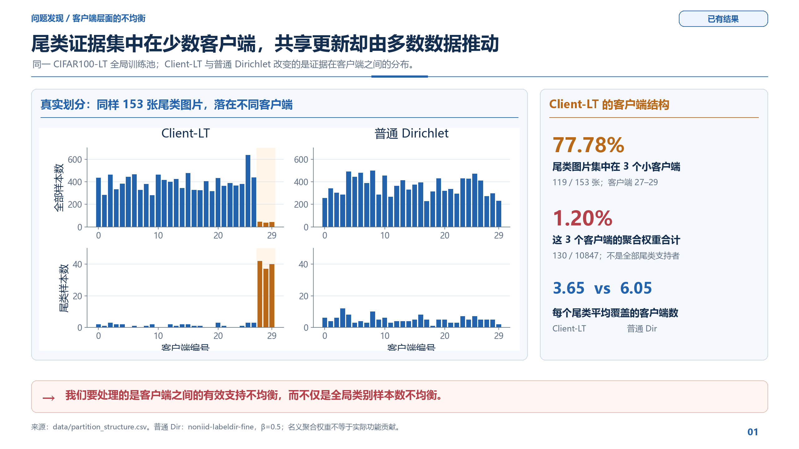
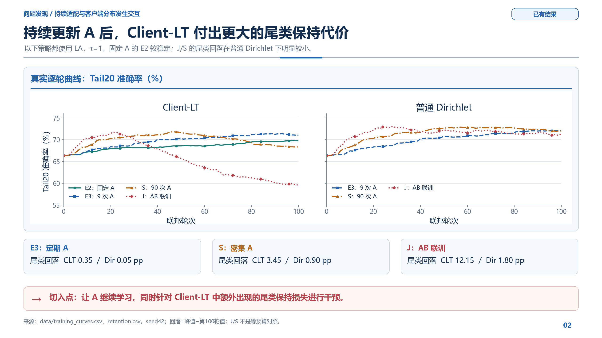
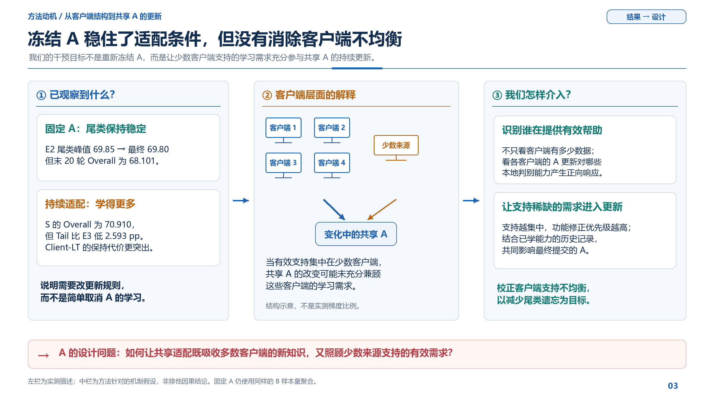
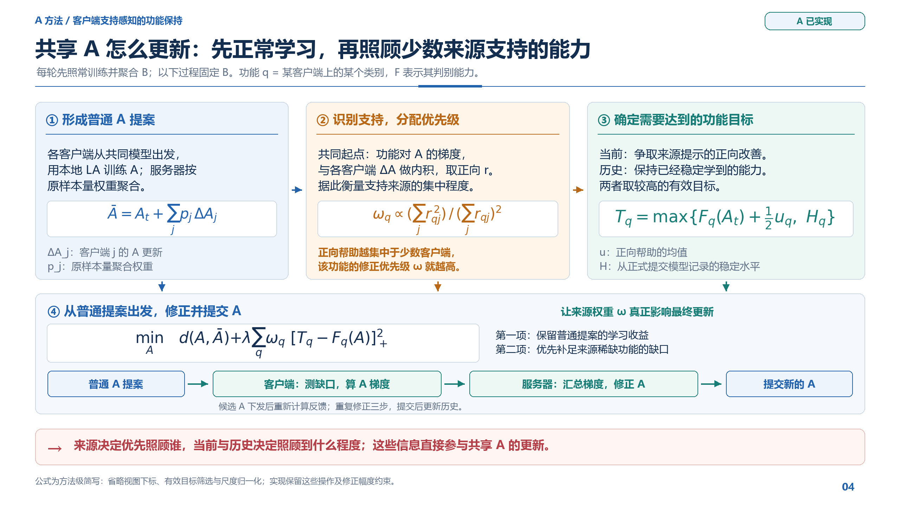
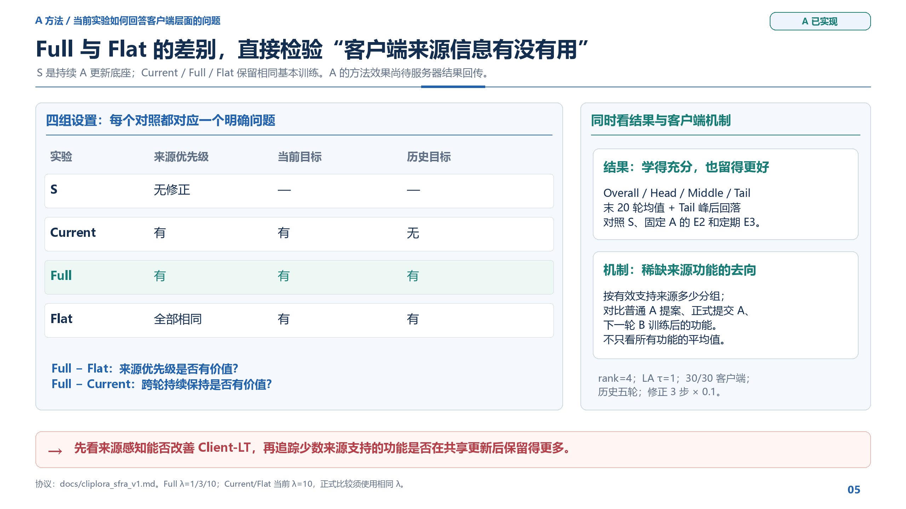
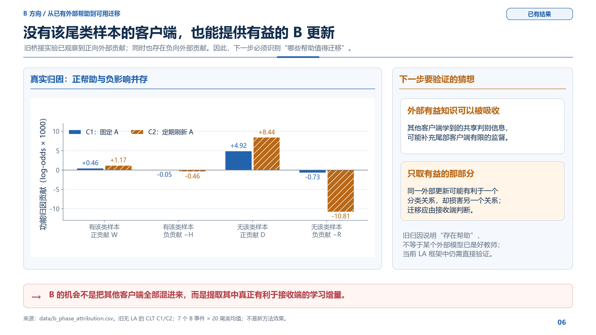
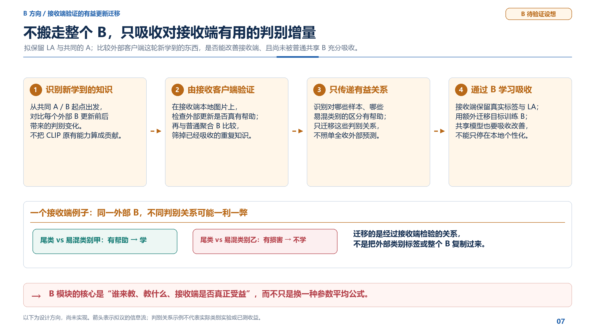
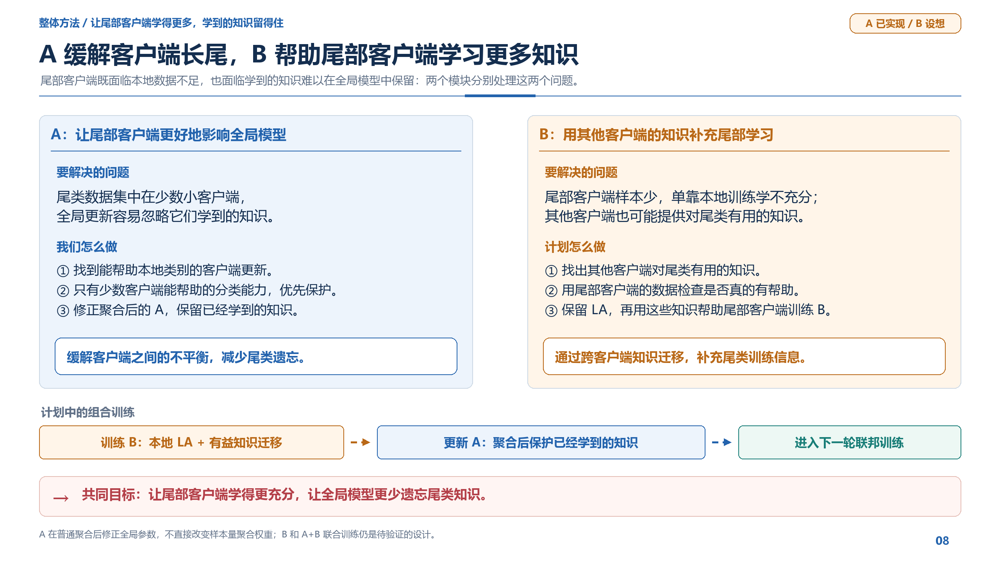
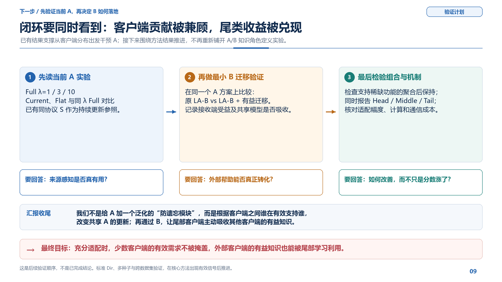

# 面向客户端长尾的 A 更新与 B 有益迁移：精简 9 页汇报

日期：2026-09-20，方法页精简修订。所有页图为 2560×1440、16:9 PNG，可直接铺满 PPT 页面。没有生成 PDF，也没有改动训练代码。

第 03 页引出介入 A 的动机后，直接接新版 `04_A_method_overview.png`，用一页说明完整操作。它替代原 04–07 四页；旧四张 PNG 与旧 12 页压缩包保留备查，不再进入当前总览或新版压缩包。其余页面内容保持原有范围，显示页码顺延；压缩包内文件连续编号。

## 一句话主线

**通过来源感知的 A 更新，针对客户端长尾造成的有效支持不均衡调整共享适配；进一步探索通过 B 吸收外部客户端的有益判别知识，补充尾部客户端有限的本地监督。**

这里的 A 是已经实现的方法；B 是待验证的设计方向。两者的干预分工不等于声称 A/B 各自只储存某一种知识。本次只压缩方法介绍，没有重新制作实验结果页。

## 建议开场白

“我们原来关心的不只是某一类有多少图片，而是这些图片在什么客户端里、这些客户端能怎样影响共享学习。现在的结果表明，持续适配 A 在 Client-LT 下产生了更明显的尾类保持代价。所以我们的第一步方法不是再给类别做一次加权，而是判断：哪些客户端真的能帮助某种能力，这些帮助是否集中在少数来源。然后让这些少数来源支持的需求实际参与共享 A 的修正。B 的下一步则是利用另一条已有观察：没有尾类样本的客户端也能提供正向帮助，我们希望把这部分有用的增量交给接收端学习。”

## 01｜尾类证据集中在少数客户端，共享更新却由多数数据推动

**讲什么：** 把问题放在客户端层面，而不是直接从“遗忘”这个结果开始。

“两种划分使用同一个全局长尾训练池，尾类总共都是 153 张图片。但 Client-LT 中 119 张位于客户端 27–29，这三个客户端总共才 130 张训练图，在样本量聚合中只占 1.20%。所以同样的尾类知识，在共享更新中面对的支持结构不一样。我们的 A 方法就从这个客户端支持不均衡出发。”

图注：Client-LT 的尾类证据集中在三个小客户端，同时每个尾类平均覆盖的客户端更少。1.20% 是指定三个客户端的名义聚合权重，不是所有尾类支持者的总权重，也不是尾类真实功能贡献。

过渡：“这个结构差异在新的 A/B 训练框架中，表现出了什么现象？”

## 02｜持续更新 A 后，Client-LT 付出更大的尾类保持代价

“这些策略都用了 LA。Client-LT 的固定 A 基线较稳定；E3 少量刷新也能继续提高。更新更自由的 J 和更密集交替的 S，虽然整体学习更多，但尾类出现了后期回落。相同策略换成普通 Dirichlet 后，这个回落小得多。这里给出的不是‘A 不能动’，而是‘共享 A 怎么动，会与客户端分布发生明显交互’。”

| 策略 | Client-LT：峰值到第100轮回落 | 普通 Dir：相同口径 |
|---|---:|---:|
| E3：九次 A 刷新 | 0.35 pp | 0.05 pp |
| S：前90轮逐轮 A 刷新 | 3.45 pp | 0.90 pp |
| J：日常 A/B 联训 | 12.15 pp | 1.80 pp |

图注：原始逐轮曲线没有平滑或选择性截取。当前只有 seed42；这不是多种子显著性结论。普通 Dir 不是固定客户端容量的 matched-Dirichlet；普通 Dir 的 E2 没有拿旧 matched 结果补齐。

协议速记：E2/E3 都是日常 B 3 epochs，分别在 10、20、…、90 轮额外 B/A 1 epoch；S 是日常 B 3 epochs、前90轮每轮额外 A 1 epoch；J 是日常 AB 3 epochs、另保留九次 A 刷新。因此它们是完整策略对照，不是只改变一个变量的等预算比较。

过渡：“冻结为什么能稳住？为什么还需要继续研究 A 的更新？”

## 03｜冻结 A 稳住了适配条件，但没有消除客户端不均衡

“固定 A 后，B 用来读取输入的低秩变换不再由 A 的更新改变，这为后续学习提供了相对稳定的条件。但客户端之间的数据和支持差异仍然存在，B 也仍然按样本量聚合。我们关心的是另一种选择：A 继续学习时，让那些只有少数客户端能够有效支持的需求也被充分考虑。”

“右边是我们的实际介入点：不是把所有小客户端都加权，而是看客户端更新对具体功能的作用，再让来源稀缺的有效需求参与共享 A 的修正。”

图注：左栏是实测；中栏是本方法针对的机制解释，尚非排他因果归因；右栏是已实现的干预思路。图中的客户端与箭头为示意，不表示实测梯度比例。

过渡：“下一页直接按实际代码说明一轮做什么。”

## 04｜共享 A 怎么更新：先正常学习，再照顾少数来源支持的能力

建议沿编号讲完，约 90 秒，不展开参数搜索或逐项实现细节：

“第一，B 先照常训练并聚合。固定这个 B，各客户端学习 A，服务器仍按样本量得到普通 A 提案。这保留了正常学习的路径。”

“第二，我们看每个客户端的 A 更新能帮助哪些本地能力。具体是在共同起点，把功能对 A 的梯度与客户端更新做内积。正向帮助如果主要集中在少数客户端，就给这项功能更高的修正优先级。”

“第三，决定要达到什么水平：一方面争取当前来源提示的改善，另一方面保持以前已经稳定学到的能力，取其中更高的有效目标。”

“最后，从普通提案开始，客户端计算距离这些目标还差多少，并按来源优先级计算 A 的梯度。服务器汇总后修正 A，同时限制对普通提案的偏离。重复三步，提交新的 A 并记录历史。这样，少数客户端支持的能力就实际参与了共享 A 的更新。”

图注：普通 A 聚合得到学习提案；跨客户端正向支持分配功能优先级，当前改善和稳定历史确定目标，最后由客户端功能反馈修正共享 A。B 在该流程中保持不变。

公式阅读说明（供追问，不必全部口播）：q 表示客户端×类别；F 是正确类相似度减最强错误类相似度；r 是跨客户端正向响应估计，ω 在激活功能间归一化；u 是有效正向来源响应的均值，H 是正式提交模型持续达到的历史水平。d 表示对普通 A 提案的标准化距离约束；方括号下标 + 表示仅惩罚未达到目标的部分。图中是方法级简写，不声称三步已经求出全局最优解；实际代码保留双视图、尺度归一化、有效目标筛选和修正半径。无当前来源时不凭空新增改善目标，历史有效时仍可继续维护。

两个起点不要混淆：来源响应在 B 聚合后、A 尚未更新的共同点估计；真正的功能修正从普通聚合 A 提案开始。历史不是偶然最高分；它从连续稳定实现的改善登记，并在后续轮次使用。

过渡：“方法讲完后，再用现有消融回答来源信息和持续保持是否有效。”

## 05｜Full 与 Flat 直接检验来源信息有没有用

“S 是原来的持续更新路径。Current 使用来源和当前目标；Full 再加入历史保持；Flat 与 Full 使用相同的目标定义，却把功能原始优先级统一。因此 Full 相比 Flat 的改善，是判断来源识别是否必要的关键；Full 相比 Current 则检验持续保持有没有价值。”

“不能只看总准确率。机制上要按有效来源多少分组，看普通 A 提案之后、修正之后和下一轮 B 训练之后，少数来源支持的功能有没有更好保留。这样才把客户端支持结构、实际更新和尾类结果接起来。”

图注：Full 的 λ=1/3/10 是开发期参数搜索；Current/Flat 当前使用 λ=10。比较消融必须保持 λ 相同。不同组独立训练后，具体目标值会随轨迹改变，“规则一致”不等于每轮目标数值相同。

此页没有添加新的训练要求。优先分析已经启动/完成的 SFRA 实验；A 方法是否有效，以真实结果为准。

过渡：“A 之外，B 为什么还有值得做的方向？”

## 06｜没有尾类样本的客户端，也能提供有益的 B 更新

“旧的桥接实验里，我们把每个客户端的 B 更新对尾类功能的贡献拆开。蓝色 C1 固定 A 时，没有该类样本的客户端仍有明确的正贡献。橙色 C2 里，外部正贡献仍在，但负贡献也很大。这个结果支持一个具体方向：不要只按‘谁有尾类样本’找知识来源，而要筛选外部更新中对接收端确实有用的部分。”

图注：只使用旧无 LA 的 Client-LT C1/C2 正常 B 归因，涵盖7个采样事件与20尾类的均值。纵轴是 log-odds 功能归因乘1000，**不是准确率百分点**。没有混入旧 matched-Dirichlet 作当前正式对照。A 方法的反馈用余弦裕度，与本图历史 log-odds 不同，不能混作同一个数值指标。

| B 阶段 | 有该类样本正贡献 W | 有该类样本负贡献 −H | 无该类样本正贡献 D | 无该类样本负贡献 −R |
|---|---:|---:|---:|---:|
| C1：固定 A | +0.463 | −0.052 | +4.922 | −0.725 |
| C2：定期 A 刷新 | +1.173 | −0.457 | +8.435 | −10.806 |

该归因不等于某个外部本地模型已经是一个好教师；当下 LA 框架中的实际可迁移性，应在 B 原型中由接收端直接检验。

过渡：“因此下一步不是简单平均两组 B，而是选择谁来教、教什么。”

## 07｜不搬走整个 B，只吸收接收端验证有益的判别增量

“外部客户端这轮具体学到了什么，要相对共同起点来判断，不能把 CLIP 原本就会的能力也算成它的贡献。然后由接收客户端拿自己的图片检验：这个更新是不是真有帮助？普通共享 B 是不是已经吸收了？如果它只是对一个易混类别的区分有帮助，就迁移这个关系，不把整套预测全部复制。”

“接收端继续用自己的标签和 LA 学习 B，同时吸收这些有用的关系。最终还需要让共享模型吸收这部分改善，否则只提高本地个性化性能，不算完成当前全局模型的目标。”

图注：本页全部是候选方向，不是已实现流程。接收端验证、增量提取、迁移目标和进入共享模型的方式还需冻结具体协议。没有宣称这类迁移操作本身已得到领域首创性证明。

暂不加入生成样本、特征扩增、长期多教师网络等独立组件，先把“识别有益增量—接收端吸收—共享模型保留”的路径做清楚。

过渡：“这样 A 与 B 就不再是两种松散技巧，而是同一个客户端长尾问题的两处干预。”

## 08｜A 缓解客户端长尾，B 帮助尾部客户端学习更多知识

“我们希望用 A 缓解客户端层面的长尾，让尾部客户端更好地影响全局模型。这里尾类数据主要集中在少数小客户端，它们学到的知识容易在后续全局更新中丢失。所以先找出哪些客户端更新能帮助这些本地类别；如果一种分类能力主要靠少数客户端帮助，就优先保护。再修正聚合后的 A，让已经学到的尾类知识留在全局模型里。”

“B 解决另一个问题：尾部客户端自己的数据少，单靠这些数据学不充分。我们计划找出其他客户端对尾类有用的知识，用尾部客户端自己的数据检查是否真的有帮助，再让 B 在原有 LA 训练之外学习这些知识。这是跨客户端知识迁移，不是简单把别人的 B 全部平均进来。”

“两个模块合起来，就是让尾部客户端学得更多，并让全局模型更少遗忘尾类。计划先训练 B，再对聚合后的 A 做知识保护，然后进入下一轮联邦训练。”

图注：左栏 A 已实现；右栏 B 和底部组合训练仍待验证。A 的“更有影响”是通过聚合后的功能反馈修正实现，不是直接提高尾部客户端的样本量聚合权重，也不把该客户端的所有更新无条件放大。图中没有声称 A/B 分别只储存某一类知识。

过渡：“最后用最小实验把这两个环节分别落实。”

## 09｜先验证当前 A，再决定 B 如何落地

“第一步直接读当前 A 的搜索与消融结果，特别看 Full 对 Flat 和 Current 的变化。第二步在选定的同一 A 方案上，比较原 LA-B 和加了有益迁移的 B，别让 A 的改变混进 B 的效果。第三步看组合训练中，少数来源功能的保持、尾类水平以及头中部学习是否同时改善，并计算代价。”

建议收尾：

“我们不是给 A 加一个泛化的防遗忘模块，而是根据客户端之间谁在有效支持谁，改变共享 A 的更新；再通过 B，让尾部客户端主动吸收其他客户端的有益知识。问题来自客户端长尾，干预发生在客户端支持与迁移关系上，尾类学习和保持是最终检验。”

## 可选的 10 分钟版本

使用新版 01–08 页；第 09 页作为计划讨论或提问时的备份。方法部分只用第 04 页，不再插入旧四张细节页。展示顺序以本讲稿和新版压缩包为准，不按目录中保留的旧图片混排。

## 技术追问备忘

| 老师可能问什么 | 对应当前实现的回答 |
|---|---|
| 客户端等权了吗？ | 没有。普通 A/B 提案仍按样本量聚合；新增功能修正按全体激活功能的来源优先级归一化，不再乘客户端样本量。 |
| 优先级就是尾类权重吗？ | 不是。单位是客户端×本地类别；看跨客户端正向支持强度的集中程度。没有用全局 head/tail 标签决定优先级。 |
| 来源识别需要逐个教师前向吗？ | A 来源使用共同点的功能梯度与客户端提案的一阶响应；薄 QR 用于紧凑表示，不做截断。三步修正才逐候选重算真实梯度。 |
| 正向来源少就一定很重要？ | 这是方法的结构性选择，要用 Full–Flat 和按来源分组的结果验证其收益。绝对正响应均值另外用于当前目标。 |
| 当前没有支持怎么办？ | 保留以前的来源优先级缓存；若有有效历史可继续维护，若当前和历史都无目标则不激活。缓存初始为1/30。 |
| 目标是测试准确率吗？ | 不是。使用固定本地训练图片的未缩放余弦判别裕度。训练侧代理可能包含拟合成分，应单独看训练外保持验证。 |
| 历史怎么开始？ | 先记初始参考，历史目标为空。固定五轮块的最小值至少改善0.001才登记，下一轮生效。 |
| 修正能保证每个功能都提高吗？ | 不提供这样的保证。使用三步受限优化，需要比较真实提交前后及下一轮的功能。 |
| 本地和服务器分别做什么？ | 本地训练与本地功能梯度，服务器普通聚合、优先级全局归一化与共同候选更新；研究代码是顺序联邦模拟。 |
| λ 是划分中的0.75吗？ | 不是。划分 specialization_lambda=0.75；方法 retention-weight 搜索1/3/10。 |
| 新方法完整参数？ | rank4、alpha1、实际scaling0.5；视觉top3层q/v；LAτ1；30客户端全参与；100轮；B3 epochs/A1 epoch；A轮次1–90；3步修正、步长0.1；五轮历史。 |
| B 已实现了吗？ | 没有。这次只将用户确定的方向画成设计图，不声称迁移方法已经完成或有效。 |

## 文件使用

- [精简9页图片总览](00_contact_sheet.png)
- [精简9页纯PNG压缩包](A方法与B方向_精简9页PNG.zip)
- [设计审查与数据口径](设计审查与数据口径.md)
- [机器可读的验证记录](validation.json)
- [可复现绘图脚本](render_slides.py)

重新生成：`python presentation/method_ab_20260920/render_slides.py`。只读取现有结果与生成图片、数据快照，不加载模型、不启动训练。
