# 从客户端证据分布到尾类保持：A 更新方法的研究切入点

日期：2026-09-19。用途：导师阶段汇报，建议正文 15–18 分钟，附录按提问展开。

本版使用 `tech-paper-template` 重建逻辑骨架，使用 `figure-designer` 重新选择图型、布局与信息层级。视觉参考仓库中的《客户端长尾日常讨论.pdf》：白底、深蓝标题、蓝色分隔线、左右分栏、结构示意与重点结论条。**全部汇报图片重新绘制，只输出 PNG，没有生成 PDF。**

交付为 **12 张正文页 + 3 张附录页**，每张 2560 × 1440，可直接作为 16:9 PPT 页面使用。原来的 11 张相关图片全部覆盖，对应关系见[图表索引与数据说明](图表索引与数据说明.md)。原文件均保留。

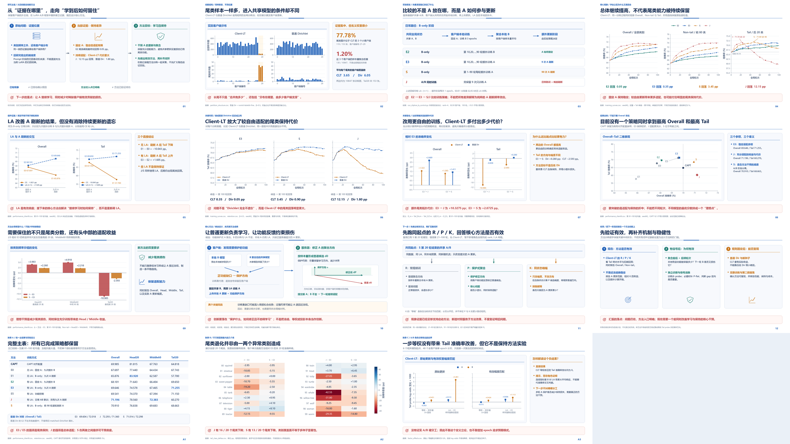

## 一、先把本次汇报要讲的一个故事说清楚

> 联邦长尾不仅取决于某类一共有多少样本，也取决于这些证据如何分布在客户端之间。在当前 LoRA 框架中，固定 A 能稳定尾类，但充分适配受到限制；持续开放 A 的训练策略提高了整体学习，却在 Client-LT 中付出更大的尾类保持代价，而普通 Dirichlet 中这一代价小得多。因此，下一步的核心不是重新证明 A/B 各自“储存什么知识”，而是设计保护客户端有效贡献的 A 更新与聚合，让模型继续学习，同时更好地留住已经获得的尾类能力。

这是**有实验支撑的问题定义 + 明确的方法方向**，不是新方法已成功的声明。

### 这次相对旧提纲的实质修改

1. **由实验流水账改成问题驱动。** 先说明旧故事如何延续，再讲新框架中最关键的保持现象，而不是按 E0、E1、E2 的运行顺序汇报。
2. **将“类别频率—客户端分布”表述为互补维度。** 不把当前普通 Dir 对照说成严格只改变一个独立变量；两种划分还同时改变容量、覆盖与共现结构。
3. **把 LA 放回底座的位置。** 它是有效组件，但不是本次新的方法贡献；重点转向持续适配中的保持问题。
4. **把 A/B 角色诊断放到附录。** 不隐瞒负结果，但不再让它主导主线或阻止方法研究。
5. **把“闭环尚未完成”改成明确的推进顺序。** 当前证据足够开始核心方法；先得到有效方法，再完成机制消融、标准 Dir 泛化和多种子验证。
6. **候选与结果分开画。** 所有 P/R/K 和保护聚合页面都明确标注为设计；不画不存在的新方法成绩、成功曲线或“理想性能点”。

### 建议开场白（约 40 秒）

“之前我们研究的是：同样的尾类样本，为什么换一种客户端分布就更难学。现在换到 LoRA A/B 框架后，我们发现这个问题并没有消失，而是更清楚地表现为保持困难：模型前面能学到尾类，后面继续适配其他类别时，又丢掉了一部分。固定 A 能保住，但不是充分学习的最终方案。所以这次我想汇报的是：我们现在已经可以进入核心方法阶段，重点改进 A 的更新与聚合。”

## 二、正文：逐页讲什么、如何接下一页

### 01｜原来的故事没有丢：从证据位置，走向尾类保持

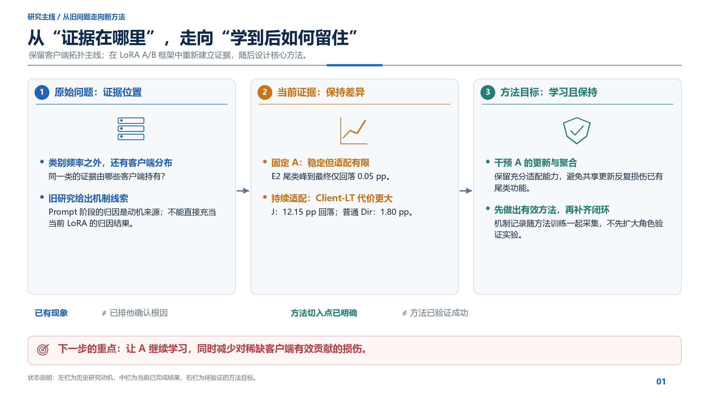

**这页回答：** 我们是不是换了一套故事？

**核心结论：** 研究对象仍然是客户端证据分布带来的学习困难；当前框架把困难具体化为“持续适配下的尾类保持损失”。

讲稿：

“左边是原来的问题：尾类证据由哪些客户端持有，会影响共享学习。中间是我们在新 LoRA 框架中重新取得的证据：固定 A 很稳定，较自由的更新提高了适配，却在 Client-LT 上更容易损失尾类。右边是顺着这些结果走出的方向：让 A 继续学，但保护已经有益的客户端功能。”

这里保留旧 Prompt 阶段的拓扑动机，但不把它的稀释/干扰数值直接移植为 LoRA 的归因结果。**已有现象不等于根因已被排他确认；方法方向明确也不等于方法已经成功。**

图注：旧研究的证据位置问题在当前 LoRA 框架中转化为尾类保持问题，支持从现象分析进入 A 更新方法研究。右栏是方法目标，不是已测结果。

过渡：“先看这两种划分究竟让尾类证据处在什么位置。”

### 02｜同样数量，不同位置：Client-LT 的证据结构

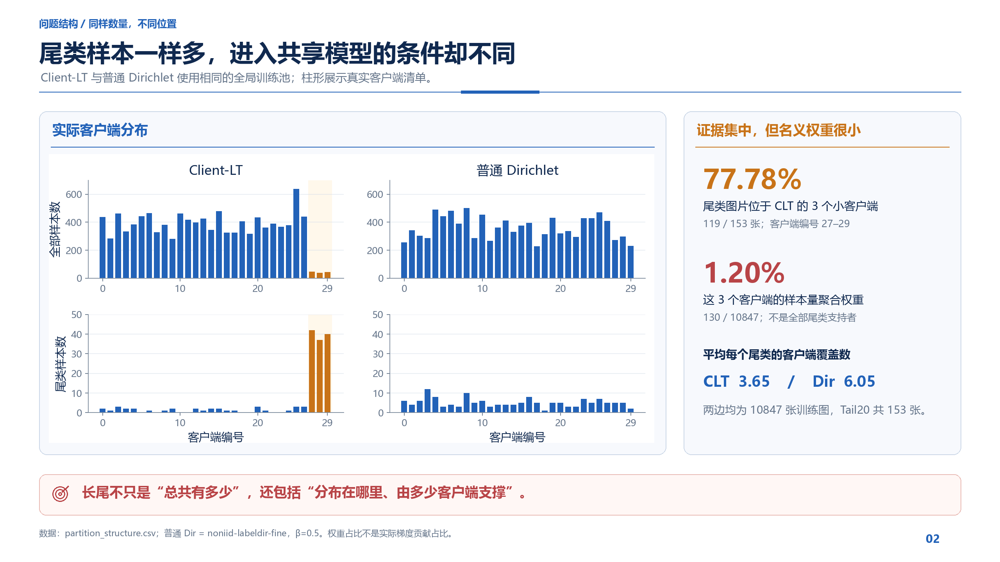

**这页回答：** 除了全局类别样本不平衡，还有什么不同？

两种划分的真实统计：

- 训练图片都是 **10847** 张；Tail20 图片都是 **153** 张。
- Client-LT 的 **119 / 153 = 77.78%** 尾类图片集中在客户端 27–29。
- 这三个小客户端一共 **130** 张图片，按样本量聚合时权重合计 **1.20%**。
- 平均每个尾类的支持客户端数：Client-LT **3.65**，普通 Dir **6.05**。

讲稿：

“左边不是一个理想化示意图，而是本次实际训练清单。两边尾类图像总数相同，但 Client-LT 把大部分尾类证据放在三个很小的客户端里。它们拥有很多尾类证据，却只占很小的样本量聚合权重。这个结构给出了保护稀缺贡献的动机，但我不会把 1.20% 直接叫作真实梯度贡献。”

图注：相同尾类样本总量在两种划分中具有不同的客户端分布和覆盖。1.20% 只属于三个指定客户端，不是所有尾类支持者的权重；实际功能影响仍需方法记录解释。

过渡：“接下来说明，我们对 A/B 究竟做了哪些控制。”

### 03｜实验框架：不是 A 的物理位置，而是更新规则

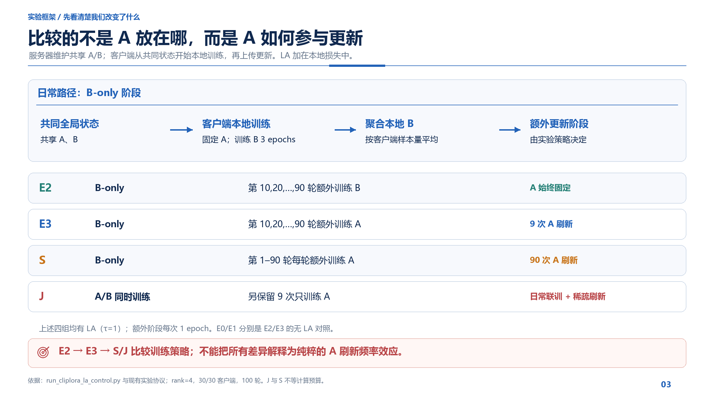

**这页回答：** E2/E3/J/S 的差别是什么？A/B 是怎么训练的？

服务器维护共享 A/B；客户端从共同状态开始，训练后上传更新。固定 A 不表示 A 不在客户端，也不是“服务器独自训练 A”。LA 是本地损失上的 logit adjustment，**不是一种名为 LA 的服务器聚合权重**。

| 策略 | 日常阶段 | 额外阶段 |
|---|---|---|
| E2 | 固定 A，B 训练 3 epochs | 第 10,20,…,90 轮额外 B 1 epoch |
| E3 | 固定 A，B 训练 3 epochs | 同样九个时点，固定 B、A 训练 1 epoch |
| S | 固定 A，B 训练 3 epochs | 前 90 轮每轮固定 B、A 训练 1 epoch |
| J | A/B 同时训练 3 epochs | 另外保留九次 A-only 刷新 |

这四组均使用 LA，τ=1，rank=4，30/30 客户端参与。E0/E1 分别是 E2/E3 的无 LA 对照。

讲稿：“E3 说明偶尔更新 A 是否有益；S 让 A 更新更密集，但和 B 分阶段；J 则每天 A/B 一起训练。S 的额外训练预算更大，J 每步训练两个因子，所以后面的结果是完整训练策略的比较，不能全部归结为只改变了一个更新频率。”

图注：E2/E3/S/J 对 A 的自由度与更新日程作出不同安排。S 与其他策略不是等计算预算，J 的联训也改变了单步训练内容。

过渡：“这些策略到底学到了什么，又保住了什么？”

### 04｜核心现象：总体继续提高，尾类却开始回落

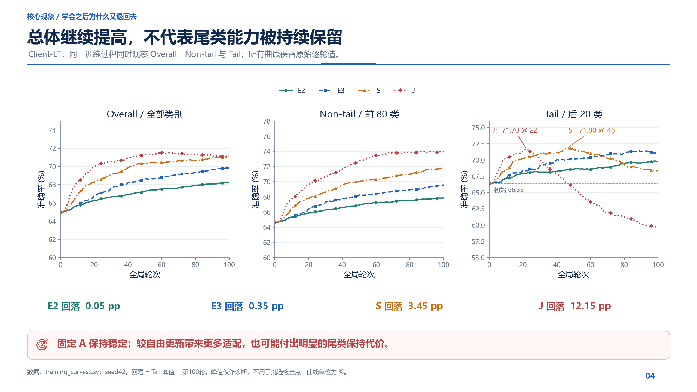

**这页是全场第一张关键图。** 请先让老师看 Tail，再用 Overall/Non-tail 说明这不是整个训练失败。

| Client-LT 策略 | Tail 峰值 | 第 100 轮 Tail | 峰到最终回落 |
|---|---:|---:|---:|
| E2 | 69.85 | 69.80 | 0.05 pp |
| E3 | 71.40 | 71.05 | 0.35 pp |
| S | 71.80（第 46 轮） | 68.35 | 3.45 pp |
| J | 71.70（第 22 轮） | 59.55 | 12.15 pp |

讲稿：

“J 不是从一开始就学不会尾类，它前面达到 71.70，后面退到 59.55；与此同时非尾类继续变好。S 也出现更温和的回落。固定 A 的 E2 基本不发生这种持续下降，但总体提升较少。关键是 E3：它比固定 A 的 Overall 和 Tail 都高，说明我们不应该得出‘A 不能更新’，而应该问‘怎样更新才能兼顾学习和保持’。”

图注：较自由的持续适配伴随更高的总体学习收益和不同程度的尾类保持损失。所有折线使用原始逐轮数据，回落定义为 Tail 峰值减去第 100 轮值；峰值不作为正式模型选择标准。

过渡：“这个问题是不是只因为没有做好类别平衡？”

### 05｜LA 有效，但它不是保持机制

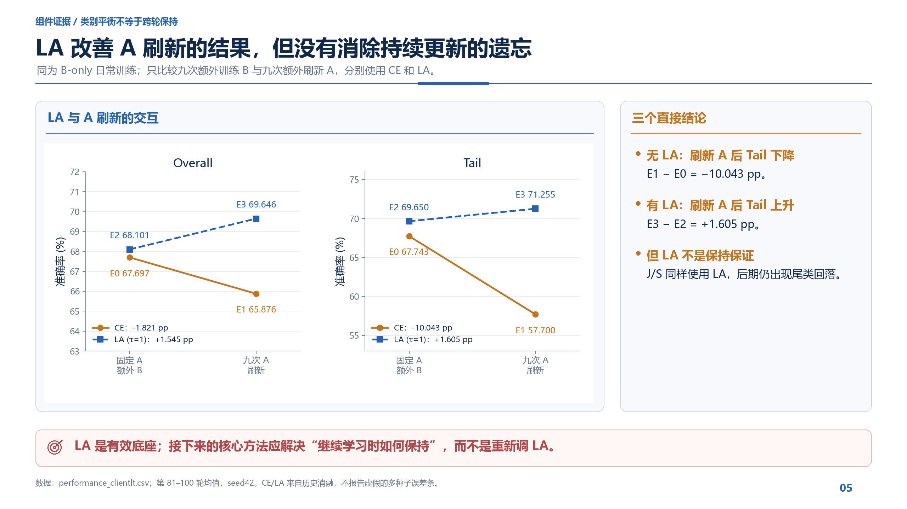

**这页回答：** 现在的进展是不是全靠 LA？

相同的“固定 A → 九次 A 刷新”比较中：

- CE 下，E1−E0：Overall **−1.821 pp**，Tail **−10.0425 pp**。
- LA 下，E3−E2：Overall **+1.5445 pp**，Tail **+1.6050 pp**。
- LA 下的 J/S 仍出现后期尾类回落。

讲稿：“LA 确实改变了开放 A 的结果，不能否认它的重要性。但它没有自动解决后续保持，因为 J/S 同样使用 LA。接下来我们保留 LA 这个有效底座，把新方法集中在持续更新的损伤控制上。”

图注：LA 与 A 刷新具有明显的描述性交互：CE 下刷新 A 降低 Tail，而 LA 下九次刷新带来收益。这不等于 LA 保证任意持续更新策略都不遗忘。

过渡：“那么这种保持损失究竟是普通长尾共有的，还是 Client-LT 更严重？”

### 06｜普通 Dirichlet 对照：Client-LT 的保持代价更大

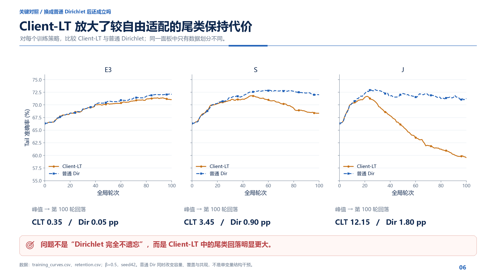

**这页是全场第二张关键图。** 正式对照只采用普通 `noniid-labeldir-fine, beta=0.5`，不混入 matched-Dirichlet。

| 策略 | Client-LT 峰到最终回落 | 普通 Dir 峰到最终回落 |
|---|---:|---:|
| E3 | 0.35 pp | 0.05 pp |
| S | 3.45 pp | 0.90 pp |
| J | 12.15 pp | 1.80 pp |

讲稿：“换成普通 Dirichlet 后，J 也不是完全不遗忘，但回落只有 1.80，Client-LT 是 12.15。S 也有同方向差异。这说明在当前配置下，Client-LT 放大了持续适配的尾类保持代价，原来的客户端证据分布主线仍然有意义。”

图注：相同训练策略在 Client-LT 上具有更大的 Tail 峰后回落。普通 Dir 对照具有相同全局训练池，但不匹配客户端容量，因此识别的是整体划分差异，不单独识别容量、共现或支持数量的因果效应。

过渡：“为了避免只比较最终分数，我们再看改变策略本身带来的额外代价。”

### 07｜策略交互：额外尾类拓扑代价

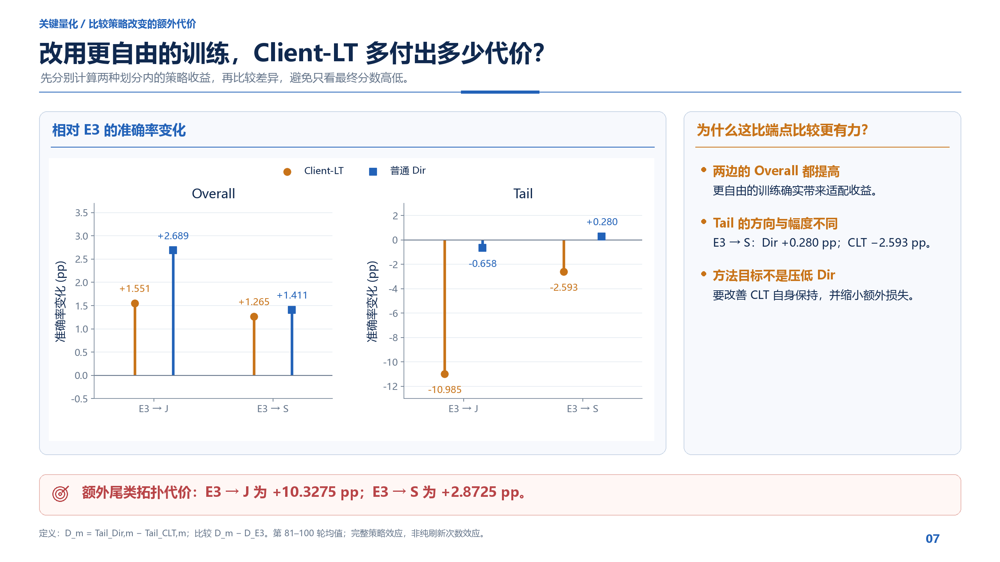

定义末20轮尾类差距：`D_m = Tail_Dir,m − Tail_CLT,m`。

| 策略改变 | Client-LT Tail 变化 | 普通 Dir Tail 变化 | 额外代价 D_m−D_E3 |
|---|---:|---:|---:|
| E3 → J | −10.9850 pp | −0.6575 pp | +10.3275 pp |
| E3 → S | −2.5925 pp | +0.2800 pp | +2.8725 pp |

讲稿：“最直观的是 E3 到 S：两边 Overall 都提高，普通 Dir 的 Tail 也略升，但 Client-LT 的 Tail 降了 2.59。我们要消除的就是这种额外代价，而不是要求方法把 Client-LT 的绝对分数做得高于 Dirichlet，更不是靠压低 Dirichlet 来缩小差距。”

图注：较自由策略在两种划分中均产生总体适配收益，但尾类代价不对称。差值的差值用于刻画这种完整策略交互，不作多种子显著性声明。

过渡：“所以现在最好的模型，到底是哪一个？不能只按 Overall 排名。”

### 08｜主结果全貌：没有一个策略全面最好

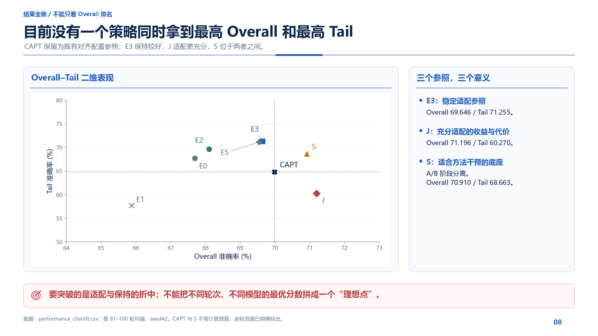

三个重要参照：

- **E3**：Overall 69.646，Tail 71.255，尾类保持好。
- **J**：Overall 71.196，Tail 60.270，整体学习充分但尾类代价大。
- **S**：Overall 70.910，Tail 68.663，且 A/B 阶段分离，适合做 A 聚合干预。

CAPT 对齐参照：Overall 69.985，Tail 64.818。S 在这两个汇报指标上都高于该参照，但并非等预算的全部 SOTA 验证。

讲稿：“这张图不是为了挑一个冠军，而是解释我们还缺什么：E3 的保持与 J/S 的适配没有被同一个规则充分兼顾。图中没有新方法星标，因为我们还没有方法结果；也没有把不同模型的最佳分数组合成一个虚构目标点。”

图注：已有策略呈现不同的 Overall–Tail 折中，没有单一策略同时获得两个最高值。CAPT 为当前对齐实现的描述性参照。

过渡：“要改进这个折中，我们具体要保住哪些学习收益？”

### 09｜目标不是少学，而是更少损伤地学

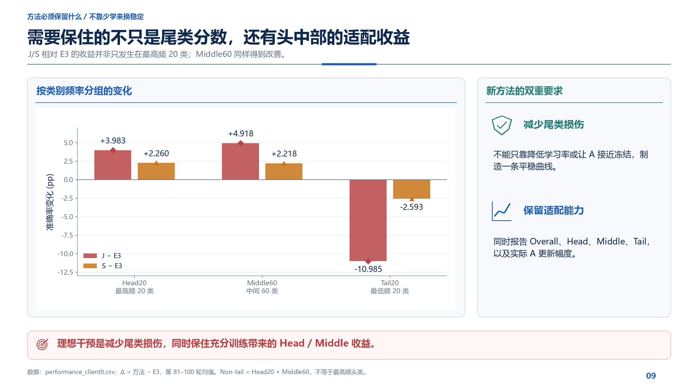

| 相对 E3 | Head20 | Middle60 | Tail20 |
|---|---:|---:|---:|
| J−E3 | +3.983 pp | +4.918 pp | −10.985 pp |
| S−E3 | +2.260 pp | +2.218 pp | −2.593 pp |

讲稿：“自由度增加带来的收益并不只在最高频头类，中间60类也得到明显改善。因此方法不能只是把 A 更新压得很小，重新回到固定 A。我们要尽量保住这部分适配收益，同时减少对尾类的损伤。”

图注：J/S 的 Head20 和 Middle60 收益伴随 Tail20 损失。新方法应同时报告这些分组结果和实际更新幅度，区分方向保护与简单少更新。

过渡：“由此，方法应该控制什么，而不是再加哪些互不相关的组件？”

### 10｜核心候选：普通聚合负责学习，功能反馈约束损伤

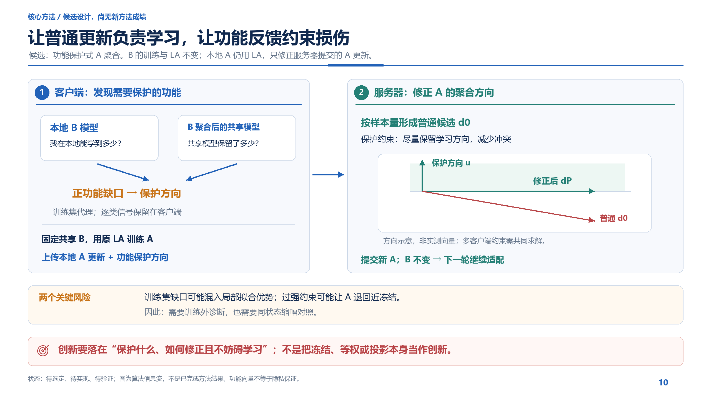

**方法定位：候选，不是已经完成的新算法。** 工作名“功能保护式 A 聚合”来自现有设计协议；本轮没有实现或运行它，也没有完成其新颖性文献评估。

候选信息流：

1. 先照常固定 A 训练 B，并聚合得到共享 B。
2. 客户端比较本地 B 模型与共享模型，找出正的功能缺口。
3. 缺口决定哪些本地功能需要保护，形成 A 空间中的保护方向。
4. 客户端仍按原 LA 训练 A；服务器先形成样本量加权的普通 A 更新。
5. 根据保护方向尽量少地修正冲突部分，再提交 A；B 训练与聚合保持原样。

讲稿：“这个方向的关键不是给小客户端一律更大权重，而是让客户端告诉服务器：什么能力在本地已经能实现，却没有被共享模型充分保留。普通聚合仍承担学习，保护信号只约束损伤。创新需要落到这个信号是否可靠、保护是否有效且不妨碍学习，而不是投影操作本身。”

图中的方向示意只解释一个局部保护约束，没有用任意坐标伪造实验结果。当前候选在训练样本固定视图上计算缺口，应称为**训练集功能代理**；额外功能向量也不提供差分隐私或安全聚合保证。

技术细节仍参考[原候选协议](../A更新保护_闭环实验协议.md)，包括普通更新 `d0`、保护方向 `u_k`、一阶约束、有效权重范数上限。方法选择仍由研究者确定：这份协议不意味着候选天然优于其他简洁方案。

图注：功能保护式 A 聚合候选将本地功能反馈与常规 A 训练分开，目标是修正损伤方向并保留适配。信号有效性、非线性提交后的真实收益及跨轮保持均待方法实验检验。

过渡：“我们不需要立即补十几组实验，先用最小方案判断这个方法值不值得继续。”

### 11｜最小方法验证：R / P / K

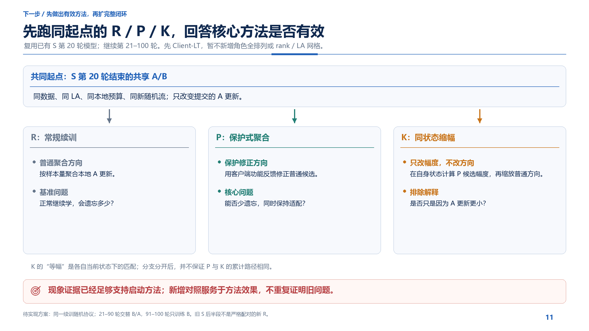

从已有 S 第20轮结束模型出发，继续第21–100轮，先做 Client-LT：

| 分支 | 提交的 A 更新 | 作用 |
|---|---|---|
| R | 原始样本量聚合 | 同一新续训协议下的常规学习对照 |
| P | 当前选定的保护候选 | 检验能否在继续适配时减少遗忘 |
| K | 普通方向，匹配自身状态下保护候选的有效幅度 | 排除只是少更新或趋近冻结 |

所有分支保留同数据、LA、本地训练预算和新随机流。第21–90轮交替更新B/A，91–100轮只更新B。

讲稿：“R 不是为了再证明旧 S 会遗忘，而是给新方法一个同起点、同续训随机协议的参照。P 检验核心方法，K 区分改变方向和单纯缩小更新。我们先只看这件事能不能做成。”

K 在**自己的当前状态**计算保护候选的有效幅度，不是读取另一条 P 轨迹的步长；分支分开后，P/K 的实际累计路径不必相等。旧 S 中途事件缺少完整训练随机状态，不能把旧 S 后80轮直接当作严格配对的新 R。

图注：同起点多轮续训可以检验保护候选的保持效果，并用缩幅对照识别“少更新”的替代解释。该计划尚未实现，不能给旧训练入口直接添加 `--method p`。

过渡：“有效以后，闭环怎样补，而不是现在先把所有扩展都跑完？”

### 12｜推进顺序：先有效，再机制，最后稳健性

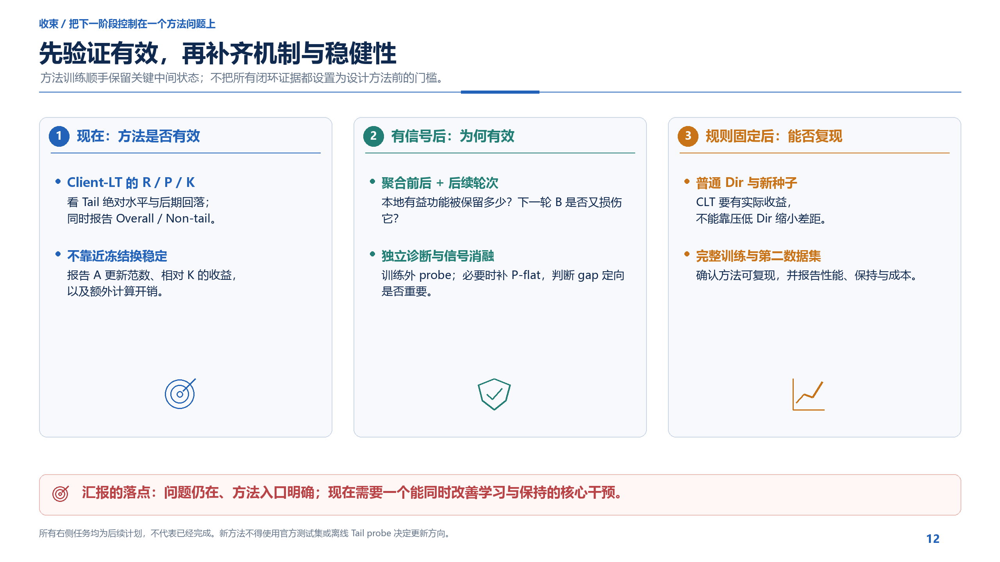

**现在：** 核心候选及 Client-LT R/P/K。看 Tail 绝对水平、后期回落、Overall/Non-tail、A 更新幅度与成本。

**有信号后：** 分析聚合前后及后续轮次的功能保持；使用训练外 probe；若强调 gap 定向的重要性，再补 P-flat。原始中间状态在方法训练时就记录，不必等方法跑完后重新训练来补日志。

**规则固定后：** 普通 Dir 同协议对照、新种子、从头完整训练与第二数据集。检验收益是否稳健，而不是只在当前已观察的 seed42 锚点成立。

建议收尾：

“我们现在的实验已经足够支撑基本问题和方法方向。下一阶段不继续扩大‘问题是否存在’的验证，而是集中做一个干预：让 A 继续学，尾类又能留得更好。等这个核心方法有效，再补完整归因和稳健性，形成论文闭环。”

图注：方法有效性是下一阶段的首要交付；机制记录与训练同步，消融和多配置确认分阶段开展。研究方向明确，不代表会议级完整方法已经得到验证。

## 三、附录：老师问到时再展开

### A1｜完整主表、CAPT 参照与实验定义

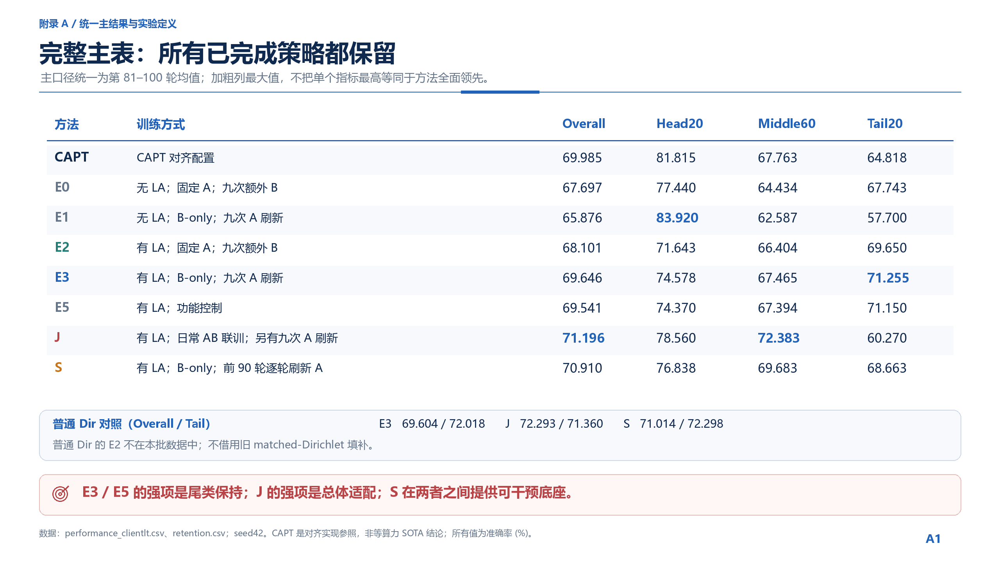

| Client-LT 方法 | Overall | Head20 | Middle60 | Tail20 |
|---|---:|---:|---:|---:|
| CAPT 对齐参照 | 69.985 | 81.815 | 67.763 | 64.818 |
| E0 | 67.697 | 77.440 | 64.434 | 67.743 |
| E1 | 65.876 | **83.920** | 62.587 | 57.700 |
| E2 | 68.101 | 71.643 | 66.404 | 69.650 |
| E3 | 69.646 | 74.578 | 67.465 | **71.255** |
| E5 | 69.541 | 74.370 | 67.394 | 71.150 |
| J | **71.196** | 78.560 | **72.383** | 60.270 |
| S | 70.910 | 76.838 | 69.683 | 68.663 |

E5 相比 E3 没有显示额外成绩优势，所以不把“更多控制策略”当作自然的创新。CAPT 的现有客户端状态设计沿用本次对齐实现，不在本次汇报重新争论；比较范围仅限此配置。

普通 Dir 的 E3/J/S 为：Overall **69.604 / 72.293 / 71.014**，Tail **72.018 / 71.360 / 72.298**。展示数字统一采用四舍五入到三位小数；原始完整精度保留在 CSV。

预算说明：CLT E3/J 总计108768 optimizer steps；S 为137280。J 同时训练A/B，因此与E3步骤数相同不等于FLOPs相同。新功能反馈的额外前向、反向、通信和墙钟时间应单独报告。

### A2｜全部20个尾类，不挑样例

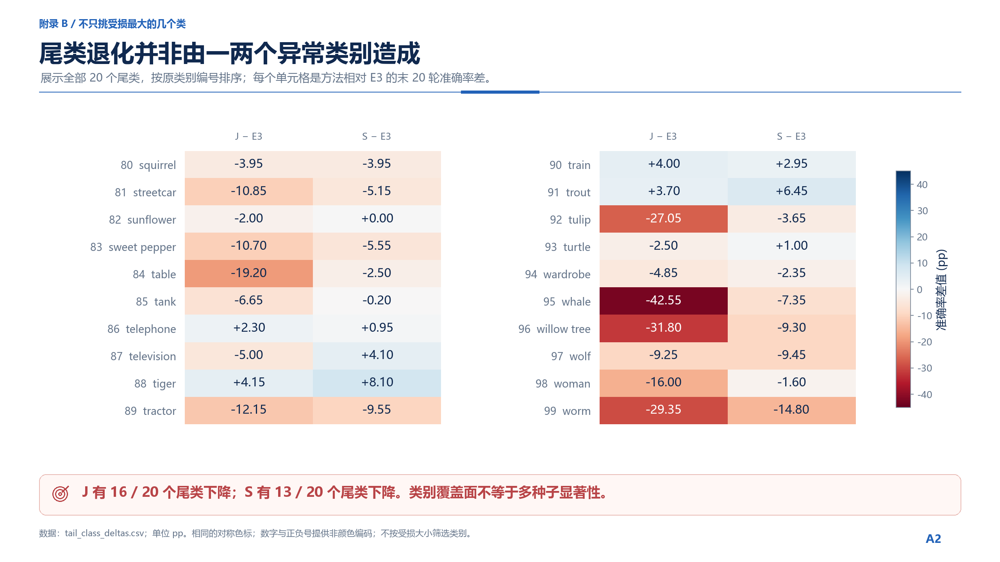

J 相对 E3 有16类下降，S 有13类下降。全体类别按原编号展示，用相同、关于零对称的色标和直接数字标注。

“广泛发生”指这20类的覆盖面，不代表20个独立重复，也不形成跨种子的显著性检验。图中每列平均值分别与主表 J−E3、S−E3 的 Tail 差值相等。

### A3｜为什么不继续追逐 A/B 硬分工

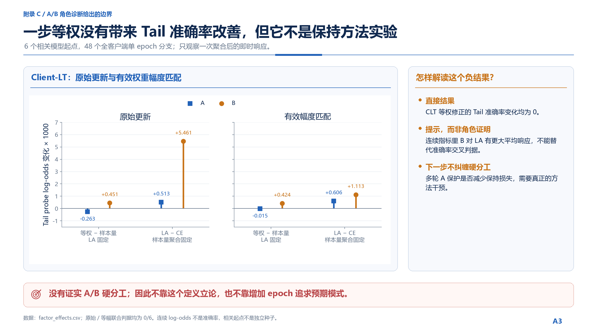

原角色诊断完成6个共同模型起点、48个全客户端单epoch分支。每个分支只测一次聚合后的即时响应，不是完整保持轨迹。

- Client-LT 上，客户端等权修正的 Tail 准确率变化均为0。
- 预设的完整角色交叉模式，原始更新与等幅更新均为0/6。
- 连续的Tail probe log-odds中，B 对LA有更强的平均响应，但这不替代准确率判据，也不证明两类知识互斥存储。

回答老师：“这个负结果否定了我们当前拿它定义 A/B 硬分工的依据，并没有回答功能保护式 A 更新在多轮中是否有效。我们已经把方法目标收敛为实际保持效果，不再让角色定义成为前置条件。”

## 四、如何使用这些文件

完整汇报：按01–12顺序使用，附录A1–A3用于回答问题。若只有10分钟，可用01、02、04、06、07、10、11、12；03与05按需要口头简述。

重新绘图，在仓库根目录运行：

```bash
python presentation/redesign_20260919/render_presentation.py
```

脚本只读取已有CSV，核对数值，绘制PNG及数据快照；不导入训练框架，不加载模型，不运行实验，也不生成PDF。它不调用原目录的旧脚本，因为那些脚本仍包含PDF导出和旧位置依赖。

配套文件：

- [论文逻辑骨架与设计审查](论文逻辑骨架与设计审查.md)：两个技能实际改变了什么、七格骨架与四项一致性检查、逐图设计审查。
- [图表索引与数据说明](图表索引与数据说明.md)：旧图到新图的完整映射、来源、统计口径。
- [验证记录](validation.json)：数据一致性与文字边界检查。
- [图片总览](00_contact_sheet.png)：15张页图缩略图；实际展示请使用单张原尺寸PNG。

本次没有更新训练代码，也没有产生新的模型结果。
