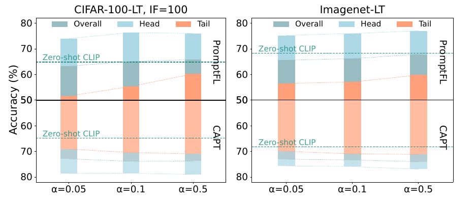
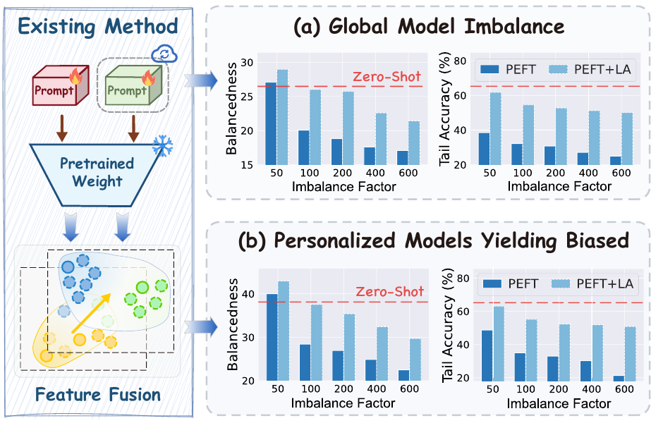
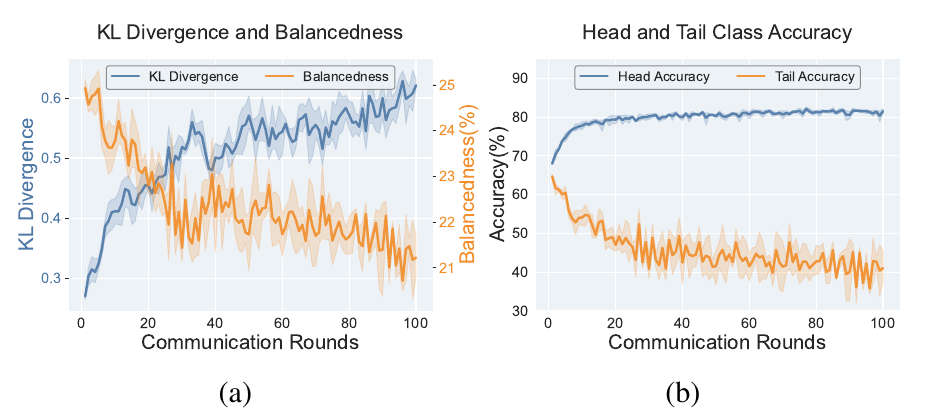

# 两篇论文的 Insight 实验与绘图设计拆解

本次直接阅读用户提供的本地 PDF，并逐页渲染查看实际图像、图注及相关正文。使用 `figure-designer` 分析首页动机图、方法解释图、实验图的不同职责，并用 `tech-paper-template` 检查发现、研究问题和方法模块之间的连接。本次是参考分析，没有重新制作我们的论文图，也没有修改技能文件。

原文：

- [CAPT](../../Hou%20等%20-%202025%20-%20CAPT%20Class-Aware%20Prompt%20Tuning%20for%20Federated%20Long-Tailed%20Learning%20with%20Vision-Language%20Model.pdf)，提供版本共17页，含补充材料。
- [FedPuReL](../../_CVPR_2026__Shihou_Hou__FedPuReL.pdf)，正文标题为 *Fine-Tuning Impairs the Balancedness of Foundation Models in Long-tailed Personalized Federated Learning*，提供版本共10页。本报告按该版本分析，不推断投稿或录用状态。

下文页码均指 PDF 物理页码。对图形的解读与可借鉴设计是本报告的分析，不等同于重新验证论文的原始实验。

## 1. 首页图怎样吸引读者

### CAPT：一个失败现象与一个修复结果形成镜像

图1位于第1页、摘要右侧。左列为CIFAR-100-LT（IF=100），右列为ImageNet-LT；每列上半部为PromptFL，下半部为CAPT。横轴使用α=0.05、0.1、0.5，α越小表示客户端异质性越强。浅蓝、橙色和灰蓝分别表示Head、Tail和Overall，并用zero-shot CLIP的虚线作参照。

它的吸引力来自三个可直接看见的反差：

1. **微调并不保证更好。** 强异质性下，PromptFL的Overall会低于zero-shot参照，读者有了一个具体的失败标准。
2. **头类和尾类并未共同获益。** 同一方法内部两组表现拉开，使“总体数字掩盖了谁受损”成为问题。
3. **CAPT使这个缺口变小。** 上下对应相同数据集、异质性和指标，读者能直接找出方法改变了什么。

版式的作用是组织比较。上下采用镜像坐标，以中间约50%的水平线向两侧展开；下半部准确率向下增大。彩色段界标出各指标位置，不能把这些色段理解成可相加的独立准确率。两列重复同一视觉语法，使第二个数据集承担重复验证的作用。

值得学的是**固定参照、对应布局、少量核心指标、能加重问题的横轴**。反向坐标增加读图成本，并非必须照搬。若我们没有足够稳定的方法结果，首页也不必照搬“上方失败、下方成功”的结构。

### FedPuReL：把失败放进发生它的流程里

图1同样位于第1页、摘要右侧。左侧画既有PEFT及特征融合路径，火焰和雪花区分可训练与冻结部件；右侧上下两块分别显示全局模型与个性化模型，每块都有Balancedness和Tail Accuracy两个柱图。横轴为IF=50、100、200、400、600；每组比较PEFT与PEFT+LA，红色虚线标出zero-shot水平。

这里的阅读路径是：**现有方法如何工作 → 全局模型出现什么问题 → 个性化模型也呈现什么问题**。左侧示意与右侧实验有明确的对应位置。作者据此提出两个研究问题：如何保持全局平衡；如何进行个性化而不继承全局偏差。

三个设计决定尤其有用：

- **增加IF，而不只放一个设置。** 横轴回答问题在何种压力下加重，读者看到一种趋势。
- **加入PEFT+LA。** 这使“直接做类别校正是否足够”这个容易想到的方案进入对照，而非等审稿人提出。
- **Balancedness与Tail Accuracy成对出现。** 前者概括跨类均衡，后者显示实用能力；仅有均衡性无法排除各类都很差的情况。

需要保留证据边界：上下两组结果与流程图支持作者的偏差传递解释，但流程箭头本身不是因果实验。图注也未完整列出图1每根柱对应的具体PEFT方法和全部配置，复用这种设计时应补全实验设置。

## 2. CAPT 的 Insight 实验如何设计与展示

| 图/表及位置 | 改变或比较什么 | 测量与展示什么 | 在论证中的作用 |
|---|---|---|---|
| 图1，第1页 | PromptFL/CAPT；α=0.05/0.1/0.5；两个数据集 | Head、Tail、Overall和zero-shot参照，镜像并列 | 引出异质性下微调收益分配不均的问题，并预告修复 |
| 图3，第7页 | PromptFL与CAPT相对CLIP的变化 | 按Overall/Head/Tail画有正有负的增益柱 | 把绝对准确率转成“微调到底帮助了谁、损伤了谁” |
| 图4，第7页 | ImageNet-LT上的PromptFL与CAPT训练过程 | 同尺度并列的Overall/Head/Tail随轮次曲线 | 显示缺口如何形成：基线头类上升、尾类下降；方法的尾类更稳定 |
| 表4，第8页 | General、Class-aware、二者组合 × 有/无聚类 | Overall/Head/Mid/Tail的二维消融表 | 分别考察提示设计和聚合组织的作用，避免所有收益都归给一个模块 |
| 图5，第8页 | General和Class-aware提示的嵌入 | t-SNE；圆点/三角区分提示类型，颜色区分类别，阴影强调集中区域 | 提供“共享信息与类别信息”的表征解释 |
| 图7，PDF第14页 | 相似性聚类与异质性聚类 | 客户端×类别的比例热图，虚线分隔簇 | 让读者看到两种聚类实际组织了怎样的客户端分布 |
| 图6，PDF第14页 | 两种簇数量的组合 | 带数值的二维准确率热图 | 参数与稳健性分析，承担辅助验证，不承担首页动机 |

参考原页：[图3/4](pages/capt-07.png)、[表4/图5](pages/capt-08.png)、[图6/7](pages/capt-14.png)。

**最值得借鉴的实验技巧是图3的“改写纵轴”。** 绝对准确率高低受任务、类别和起点影响；减去CLIP对应组的准确率以后，零线有了清楚含义：向上表示适配带来收益，向下表示适配造成损失。这使尾类受损成为可见的负值，无需读者在多个柱子之间心算。准确率之差按严格单位应标pp，原图写Accuracy Gain，复用时应明确单位。

**图4让尾类下降成为过程证据。** 作者没有仅用最终Tail较低推断遗忘，而是展示它随训练轮次下降。需要注意，这组图已经包含我们关心的“后续训练使尾类退化”现象，因此我们不能把这种现象本身当作相对CAPT的独有发现。

**表4与图5承担不同职责。** 表4检验配置的实际增益；图5提供与双提示设计一致的视觉解释。t-SNE中的集中或分散不能独立证明模型存储了哪类知识，也不能据此推断我们的LoRA A/B具有相同分工。

### CAPT 的方法解释图

[图2，第4页](pages/capt-04.png)采用三阶段布局：左侧大区域为本地训练，右上为客户端聚类，右下为推理。

- 左侧最大，因为需要讲清General与Class-aware两条提示路径、冻结编码器以及损失连接。
- 右上用小型本地分布曲线和客户端分组说明聚类，不把全部数学定义挤进图中。
- 右下用图像输入和文字预测收束，让读者知道这些模块最后用于什么。
- General与Class-aware在各区域沿用相同颜色和符号；火焰/雪花提供无需阅读长句的训练状态标记。
- 图内大部分标注是对象名、阶段名或损失名，长解释放到正文和图注。

可借鉴的是“按读者理解任务分区”和跨区复用符号；每个框都应对应正文能找到的模块。

## 3. FedPuReL 的 Insight 实验如何设计与展示

| 图/表及位置 | 改变或比较什么 | 测量与展示什么 | 在论证中的作用 |
|---|---|---|---|
| 图1，第1页 | IF；PEFT/PEFT+LA；全局/个性化模型 | Balancedness、Tail Accuracy、zero-shot参照 | 发现问题并排查一种直接补救方案 |
| 图2，第3页，分析续于第4页 | 同一训练过程的推进 | 左：TKL与Balancedness；右：Head/Tail准确率 | 把预测偏移、跨类失衡与尾类损失联系起来，形成方法动机 |
| 图6，第8页 | 平衡/不平衡数据；TKL/普通KL，并展示方法轨迹 | 两种散度随训练变化 | 检查诊断量是否把正常置信度变化误当成失衡 |
| 图4，第8页 | 多种方法；全局/个性化模型 | Balancedness随训练变化及zero-shot水平 | 方法实施后返回最初的问题指标，检查是否保持平衡 |
| 图5(a)，第8页 | FedPuReL/PromptFL | 本地与全局参数L2距离随轮次变化 | 检查共享参照是否伴随更小的客户端漂移 |
| 图5(b)，第8页 | 按样本量排序的类别，分Many/Med./Few | 正确预测的全局/个性化分支贡献比例 | 检查两个分支是否呈现预期的互补模式 |
| 表4，第7页 | 单独梯度净化、单独残差、组合；替代平衡与个性化方案 | 全局/个性化及各频率组准确率 | 验证两个模块各自及组合的作用，并与容易想到的替代方案比较 |

参考原页：[图2及指标定义](pages/fedpurel-03.png)、[观察与方法衔接](pages/fedpurel-04.png)、[消融表4](pages/fedpurel-07.png)、[图4/5/6](pages/fedpurel-08.png)。

**这篇的关键技巧是先把想解释的机制变成可观察量。** TKL先用温度调整对齐预测分布的熵，目的是减少置信度尺度差异的干扰；Balancedness概括各类别准确率的相近程度。图2把二者放到同一训练时间轴，旁边用Head上升/Tail下降说明它们对应的实际性能现象。

**图6进一步验证测量工具。** 如果普通KL在平衡数据上也随微调升高，那么“偏离zero-shot”未必意味着长尾偏差；TKL与普通KL、平衡与不平衡数据的对照，使作者能讨论诊断量的区分能力。这比只报告“新指标与准确率相关”更完整。图2的双轴趋势仍是关联证据，不应单凭共同随时间变化就作排他的因果结论。

**图4回到开篇提出的承诺。** 首页讲平衡遭到破坏，方法实验就重新画平衡随训练的变化，而非只给Overall提升。诊断图与方法验证图使用相同问题语言，读者很容易理解方法修复了哪里。

**图5把模块职责落到行为上。** 梯度净化对应客户端漂移，残差分支对应各频率组的贡献。图5(b)按类别样本量排序并标出Many/Med./Few背景，比打乱类别顺序更能显示分支贡献随数据稀缺程度的变化。提供版本对“dominant contributor”的精确定义仍不充分，不能把这个贡献曲线当作无需额外定义的通用归因方法。

### FedPuReL 的方法解释图

[图3，第4页](pages/fedpurel-04.png)由左侧全局平衡训练、中部服务器聚合、右侧个性化残差三块构成。

- 左侧显式画出zero-shot与可训练分支，底部的温度对齐和梯度投影小图解释“如何保住平衡”。
- 中部以Shared/Private区分哪些参数上传聚合、哪些留在本地，回答联邦系统中的关键关系。
- 右侧把冻结全局分支、可训练个性化分支以及输出相加画出来，解释残差如何加入。
- 火焰/雪花、参数块/编码器/概率柱等形成一套可复用的视觉词汇。

蓝、绿、红区域帮助识别职责。手绘边框、斜线底纹和装饰图标并不是论证成立的原因；高密度公式和细线在缩到正文尺寸后也可能难读。借鉴时优先保留模块关系与关键操作。

## 4. 两篇论文如何把发现接到方法

两篇都是以方法贡献为主的论文，但组织重点不同。以下用 `tech-paper-template` 的逻辑单元拆解；这是叙事结构分析，不是对全部科学结论的审稿判定。

| 逻辑单元 | CAPT | FedPuReL |
|---|---|---|
| 场景 | VLM提示学习面对非IID与长尾共同影响 | 基础模型在长尾个性化联邦学习中适配 |
| 局限1 | 微调收益偏向头类，尾类受损 | 全局微调破坏原有跨类平衡 |
| 局限2 | 客户端分布差异使尾类知识共享困难 | 既有个性化融合仍出现偏差 |
| 核心思路 | 区分共享与类别相关提示，按分布组织知识共享 | 用zero-shot参照约束全局更新，在冻结全局分支上做输出残差 |
| 挑战 | 类别细节与共享信息如何兼顾；异质客户端如何聚合 | 如何识别和约束偏离平衡的更新；如何适配而不改坏全局分支 |
| 方法模块 | General/Class-aware提示、对齐、客户端聚类 | 温度对齐与梯度净化、个性化残差 |
| 方法正文入口 | 第3.2节双提示、第3.3节聚类等 | 第3.2节诊断、第3.3.1节净化、第3.3.2节残差 |
| 验证与贡献落点 | 主性能、组别增益、训练过程、提示×聚类消融 | 全局/个性化性能、平衡轨迹、指标对照、模块消融与行为分析 |

四项一致性检查：

1. 局限→思路：二者都把方法入口指向开篇强调的问题，而非开篇讲一个问题、方法解决另一个问题。
2. 思路→挑战：CAPT围绕提示粒度与聚合组织；FedPuReL围绕参照、更新方向和个性化位置。
3. 挑战→模块：主要模块可以回指对应问题；方法解释图把这些对应关系显式画出。
4. 模块→验证：CAPT用提示×聚类消融，FedPuReL用净化/残差及替代方案消融。叙事衔接明确，但t-SNE、双轴趋势或流程箭头不自动完成因果验证。

尤其要区分两类图：图1/预分析用于提出研究问题；t-SNE、分支贡献及模块消融多是方法后的解释与验证。它们不能全都被当作设计方法之前就已经独立成立的insight。

## 5. 可以直接采用的绘图与实验技巧

1. **先确定读者应该惊讶于什么。** CAPT是“微调使一部分能力变差”；FedPuReL是“全局失衡与个性化偏差并存”。首页应突出一个主问题。
2. **选一个有含义的参照。** zero-shot代表未做适配的已有能力；峰值、同起点状态、相同样本池对照也可成为参照，但必须服务当前问题。
3. **让横轴承担科学问题。** α表示异质性强度，IF表示长尾严重度，round表示退化过程；横轴不能只是摆放任意实验编号。
4. **将总体结果拆成受益方与受损方。** Head/Tail或Non-tail/Tail的组合揭示Overall无法说明的变化；相对参照的增益图可减少读者心算。
5. **一个子图回答一个问题，子图之间构成递进。** 分布在哪里→能力如何变化→哪种行为与变化相联系，而非三块同等大小的统计图拼贴。
6. **为新诊断指标安排对照。** FedPuReL的平衡数据对照值得借鉴：指标高，是所解释的风险，还是置信度、原始难度、样本数等共同变化？
7. **方法验证重新测量开篇的问题。** 开篇讲保持，后文需要保持轨迹；开篇讲有效来源，后文需要来源诊断与对应消融。
8. **颜色、形状、位置都表达固定语义。** 可训练/冻结、General/Class-aware、Shared/Private等在各图保持一致；同一种方法在相邻图不要频繁换色。
9. **关键对象优先用具体名字。** 首页读者应看到“固定A”“定期更新A”“密集交替更新”，实验代号E2/E3/S可作为补充。
10. **用读者能理解的图元解释机制。** 客户端、类别样本、更新箭头、概率输出比大量长句框更有效；示意箭头不能伪装成测得的贡献。
11. **把配置、预算和完整口径放到图注及实验协议。** 图内保留解读必需的信息，避免脚注占据和主图同等的视觉权重。
12. **依靠结构形成重点。** 主证据更大、辅助证据更小；背景浅、主要路径清楚。字号合格、导出矢量只是基础，不代表图已能说服读者。

无需照搬：CAPT的镜像纵轴和叠色色段、FedPuReL的斜线底纹和密集公式。也不能照搬未明确定义的阴影带、用t-SNE证明知识分工，或由双轴相关直接下因果结论。

## 6. 这对我们当前三个 Insight 意味着什么

上一版将三条发现各配一组标准统计图，数值虽能核对，但没有突出本文相对于上述论文的独特问题。尤其是：

- “尾类后期会下降”在CAPT图4、FedPuReL图2中已经出现；只能作为我们的关键现象，不能独自承担差异化。
- 类别直方图、热图、曲线和散点缺少明确的主次关系，读者需要自己推导它们为何相连。
- E2/E3/S/J先以实验代号出现，页面把理解训练配置的负担交给了读者。
- 从“发生遗忘”跳到“来源感知保护”的关键联系，不能靠画一条箭头补上。

基于目前已核对的证据，我们可用来组织首页的中心句是：

> **在同样的全局类别长尾下，客户端分布不同，已经具备的尾类能力会呈现不同的保持轨迹。**

三个发现应共同支持这一问题：第一条固定全局样本，定位客户端分布这一差异；第二条呈现已有能力在后续共享训练中回落；第三条用E3等对照说明适当适配仍有收益，研究应落在如何更新与保持。

下一层方法机制应单独提出：

> **对少数有效帮助来源依赖更强的类别功能，是否更难在后续更新中得到维护？这种信息能否用于更有效的保护？**

这仍是待验证的问题。对应FedPuReL“TKL是否确实反映失衡”的做法，我们应检查来源集中度与后续功能下降的联系，并同时考虑当前能力、类别样本量和正向响应总量；之后用来源加权与等权保护的消融检验使用该信息是否有增量价值。标签拥有者数量不等于有效帮助来源数，来源集中也不等于帮助总量小。

如果将来重画，建议采用“一个首页主图＋分开的诊断图”组织，主图先给同样数据却出现不同保持轨迹的反差；详细逐类热图、全部策略、预算表和逐类回落放在研究发现部分。首页是否加入方法效果，应依据最终结果稳定性决定，不用尚未验证的机制图制造完整故事。

## 7. 本次设计审查的结论

按 `figure-designer`，CAPT首页属于“失败现象＋方法结果预告”，FedPuReL首页属于“方法情境＋失败证据”；二者的方法解释图属于分区系统/阶段总览，后续诊断图分别采用增益柱、时间曲线、热图、表征图等。图型选择与它们承担的问题对应。

针对我们上一版的优先修正是：

1. **MAJOR：中心问题不够突出。** 先确定本文区别于参考论文的具体反差，再决定首页放哪些图。
2. **MAJOR：现象到来源机制缺乏直接证据。** 单独安排诊断量与对照，不把方法设计动机写成已证明机制。
3. **MAJOR：视觉层级不足。** 精简实验代号和脚注，给核心反差更大的面积，辅助图分流。

已有图的字号、数值、文件格式检查通过，只能说明可读性和可复现性的一部分。本次不再以“无越界、矢量导出”替代论文重点和叙事效果的审查。未制作新图，因此不对新图给出尺寸、字体或完整性通过结论。
