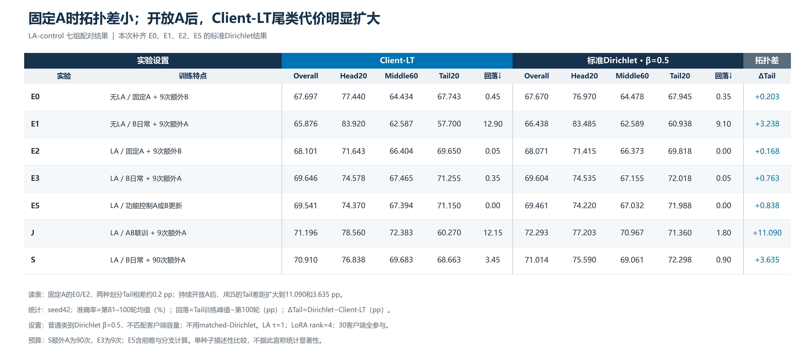
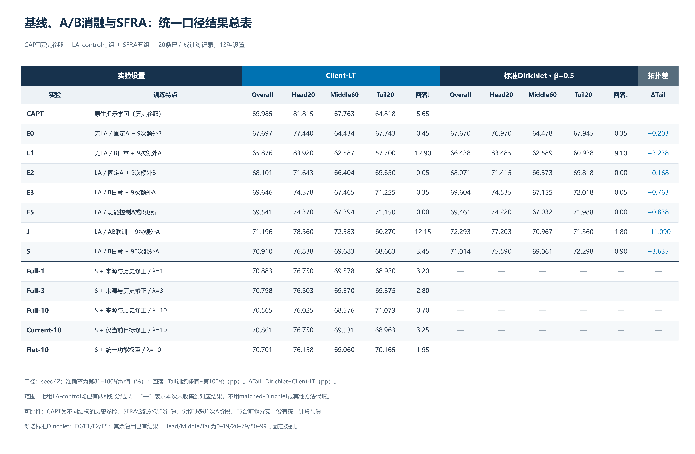

# 更新大表：Client-LT与标准Dirichlet

日期：2026-09-20。新增包实际包含4组完成结果：E0、E1、E2、E5；结合既有标准Dirichlet E3/J/S后，七组LA-control配对齐全。不是SFRA的Dirichlet结果。没有重新训练或修改原始输出。

## 1. 统计口径

- 准确率统一为第81–100轮均值，逐类文件对应epoch80–99；从原始逐类CSV重算并逐轮核对round_metrics。逐类输入仅清除1e-8以内浮点写出误差，展示采用half-up三位小数。
- Head20：类别0–19；Middle60：20–79；Tail20：80–99。Non-tail80另保留在CSV中，不把它称为Head。
- 回落：第1–100轮Tail最高值减去第100轮Tail，单位pp；不与峰值减末20轮均值混用。
- 标准Dirichlet只使用`noniid-labeldir-fine`、β=0.5。旧`matched-dirichlet`不纳入本表。
- seed42、100轮；单次运行，不画虚构方差。E5前瞻/S额外训练/SFRA功能修正等预算差异保留。
- 同一种划分内部，七组的样本划分记录及客户端参与日程直接比对，见`协议检查.csv`；没有做哈希审查。
- CAPT没有本协议completion标记，已检查100轮曲线及末20轮逐类文件完整。其他19组有100轮完成标记。

## 2. 七组配对大表

| 实验 | 训练特点 | CLT Overall | CLT Head | CLT Middle | CLT Tail | CLT回落 | Dir Overall | Dir Head | Dir Middle | Dir Tail | Dir回落 | ΔTail |
|---|---|---:|---:|---:|---:|---:|---:|---:|---:|---:|---:|---:|
| E0 | 无LA / 固定A + 9次额外B | 67.697 | 77.440 | 64.434 | 67.743 | 0.45 | 67.670 | 76.970 | 64.478 | 67.945 | 0.35 | +0.203 |
| E1 | 无LA / B日常 + 9次额外A | 65.876 | 83.920 | 62.587 | 57.700 | 12.90 | 66.438 | 83.485 | 62.589 | 60.938 | 9.10 | +3.238 |
| E2 | LA / 固定A + 9次额外B | 68.101 | 71.643 | 66.404 | 69.650 | 0.05 | 68.071 | 71.415 | 66.373 | 69.818 | 0.00 | +0.168 |
| E3 | LA / B日常 + 9次额外A | 69.646 | 74.578 | 67.465 | 71.255 | 0.35 | 69.604 | 74.535 | 67.155 | 72.018 | 0.05 | +0.763 |
| E5 | LA / 功能控制A或B更新 | 69.541 | 74.370 | 67.394 | 71.150 | 0.00 | 69.461 | 74.220 | 67.032 | 71.988 | 0.00 | +0.838 |
| J | LA / AB联训 + 9次额外A | 71.196 | 78.560 | 72.383 | 60.270 | 12.15 | 72.293 | 77.203 | 70.967 | 71.360 | 1.80 | +11.090 |
| S | LA / B日常 + 90次额外A | 70.910 | 76.838 | 69.683 | 68.663 | 3.45 | 71.014 | 75.590 | 69.061 | 72.298 | 0.90 | +3.635 |

## 3. 包含CAPT与SFRA的扩展表

| 实验 | 训练特点 | CLT Overall | CLT Head | CLT Middle | CLT Tail | CLT回落 | Dir Overall | Dir Head | Dir Middle | Dir Tail | Dir回落 | ΔTail |
|---|---|---:|---:|---:|---:|---:|---:|---:|---:|---:|---:|---:|
| CAPT | 原生提示学习（历史参照） | 69.985 | 81.815 | 67.763 | 64.818 | 5.65 | — | — | — | — | — | — |
| E0 | 无LA / 固定A + 9次额外B | 67.697 | 77.440 | 64.434 | 67.743 | 0.45 | 67.670 | 76.970 | 64.478 | 67.945 | 0.35 | +0.203 |
| E1 | 无LA / B日常 + 9次额外A | 65.876 | 83.920 | 62.587 | 57.700 | 12.90 | 66.438 | 83.485 | 62.589 | 60.938 | 9.10 | +3.238 |
| E2 | LA / 固定A + 9次额外B | 68.101 | 71.643 | 66.404 | 69.650 | 0.05 | 68.071 | 71.415 | 66.373 | 69.818 | 0.00 | +0.168 |
| E3 | LA / B日常 + 9次额外A | 69.646 | 74.578 | 67.465 | 71.255 | 0.35 | 69.604 | 74.535 | 67.155 | 72.018 | 0.05 | +0.763 |
| E5 | LA / 功能控制A或B更新 | 69.541 | 74.370 | 67.394 | 71.150 | 0.00 | 69.461 | 74.220 | 67.032 | 71.988 | 0.00 | +0.838 |
| J | LA / AB联训 + 9次额外A | 71.196 | 78.560 | 72.383 | 60.270 | 12.15 | 72.293 | 77.203 | 70.967 | 71.360 | 1.80 | +11.090 |
| S | LA / B日常 + 90次额外A | 70.910 | 76.838 | 69.683 | 68.663 | 3.45 | 71.014 | 75.590 | 69.061 | 72.298 | 0.90 | +3.635 |
| Full-1 | S + 来源与历史修正 / λ=1 | 70.883 | 76.750 | 69.578 | 68.930 | 3.20 | — | — | — | — | — | — |
| Full-3 | S + 来源与历史修正 / λ=3 | 70.798 | 76.503 | 69.370 | 69.375 | 2.80 | — | — | — | — | — | — |
| Full-10 | S + 来源与历史修正 / λ=10 | 70.565 | 76.025 | 68.576 | 71.073 | 0.70 | — | — | — | — | — | — |
| Current-10 | S + 仅当前目标修正 / λ=10 | 70.861 | 76.750 | 69.531 | 68.963 | 3.25 | — | — | — | — | — | — |
| Flat-10 | S + 统一功能权重 / λ=10 | 70.701 | 76.158 | 69.060 | 70.165 | 1.95 | — | — | — | — | — | — |

空白表示本次收集范围内没有相应结果，并不替用户断言服务器没有做过。CAPT是不同结构的历史参照；SFRA是额外功能计算的方法版本，不是LA-control的另一种代号。

## 4. 这批新增结果补齐了什么

**固定A时，Tail拓扑差很小；开放A以后，Client-LT出现更大的尾类代价。LA改善了两种划分下的类别学习，但没有消除Client-LT在较自由适配下的额外损失。**

E0的标准Dirichlet−CLT Tail差为0.2025 pp，E2为0.1675 pp。E1增至3.2375 pp；J为11.0900 pp，S为3.6350 pp。这是具体实验设置上的观察，不是A只编码客户端知识、或者所有尾类损失只来自A的证明。

| 策略变化 | 对比 | CLT Tail变化 | Dir Tail变化 | 两者差：Dir−CLT |
|---|---|---:|---:|---:|
| 固定A时加入LA | E2-E0 | +1.908 | +1.873 | -0.035 |
| 定期A时加入LA | E3-E1 | +13.555 | +11.080 | -2.475 |
| 无LA时开放A | E1-E0 | -10.043 | -7.008 | +3.035 |
| 有LA时开放A | E3-E2 | +1.605 | +2.200 | +0.595 |
| 改为日常AB联训 | J-E3 | -10.985 | -0.658 | +10.328 |
| 改为密集A交替 | S-E3 | -2.593 | +0.280 | +2.873 |
| 加入功能控制 | E5-E3 | -0.105 | -0.030 | +0.075 |

相对E3，J的额外Tail拓扑差为10.3275 pp，S为2.8725 pp。这里比较的是策略改变带来的两种划分收益差，不是仅拿两个最终分数作结论；S训练预算同时增加，不能称为纯频率消融。

无LA时，E1相对E0在两种划分都造成明显Tail损失（CLT −10.0425，Dir −7.0075 pp）。因此不能说“标准Dirichlet从不遗忘”。LA后，E3相对E2在两种划分均改善Tail；改为J时CLT损失显著更大。标准Dirichlet的J也并非Tail最优：它的Overall最高，但Tail低于该划分的E3和S。

E5相比E3的Tail变化为CLT −0.105、Dir −0.030 pp，当前表没有显示功能门控优于简单九次A刷新。SFRA只已有本地收集到的CLT五组，不能用本次LA-control Dir结果替代SFRA跨拓扑验证。

## 5. 实验特点与预算说明

- E0/E2：A全程固定，日常B训练3 epoch；10、20、…、90轮各加1个B epoch。区别是CE/LA。
- E1/E3：日常B训练3 epoch；同九个时点，各冻结共同B训练1个A epoch。区别是CE/LA。
- E5：LA、A/B候选、2轮前瞻和功能控制。本次两种划分均接受7次A，第92轮永久冻结，含未选择分支成本。
- J：LA、日常A/B同时训练3 epoch，同时保留九次额外A；不能称为没有额外A的纯联合训练。
- S：LA、日常B训练3 epoch，第1–90轮各加1个A epoch，第91–100轮B-only。
- SFRA：沿S节奏对共享A提案增加3步功能修正；Full有来源优先级和历史目标，Current不使用历史目标，Flat统一功能权重。λ是保持强度，不是划分参数。
- LA只用于训练，tau=1；两种划分都按样本量聚合普通提案。Dir不强制匹配客户端容量，实际steps略有变化。详细步数在`完整结果_长表.csv`。

## 6. 设计与技能检查

使用figure-designer的实验结果设计与完整性审查；此处为精确数值比较，采用分组数值矩阵（大表），而非拥挤的多组柱状图。

1. 类型：实验结果支持图；两种划分并排，方法与训练特点在左，最后一列给出Tail差。
2. 布局：配对表24×10.8英寸、扩展表24×15.7英寸，200dpi；深蓝标题、蓝/深蓝分区、交替浅灰行。
3. 标注：所有单元格为实测重算值；回落和准确率单位分开；不存在的对照标记“—”；不把Full整行加粗为赢家。
4. 工具：Matplotlib可复现渲染，CSV和HTML可编辑；不使用图像生成模型绘制数值。
5. 格式：遵循用户此前PNG、不输出PDF的偏好，覆盖技能默认矢量导出；纸面投稿时可由同一脚本增导矢量。
6. 色盲可读：颜色只作分组辅助，组名、完整数值和符号独立传达信息；无坐标轴截断、无3D、无装饰渐变。
7. 完整性：未选择测试最佳checkpoint；20轮不是20次独立重复；新4组与旧3组来源明确区分。

已逐图检查两张PNG的文字大小、边距、列对齐、缺项与脚注；可见文字无重叠、裁切。通用审查：字体/配色/自包含说明/完整性通过，坐标轴不适用；矢量项按用户PNG偏好豁免。0项CRITICAL、0项MAJOR；投稿时需按版式重新导出矢量。用于大表阅读/汇报，不建议把整张13行宽表缩成论文单栏。

## 7. 文件与复现

- `01_LA七组_双划分大表.png`：七组严格配对，适合本次新增结果汇报。
- `02_CAPT_LA_SFRA_完整大表.png`：加CAPT/SFRA，总计13行设置。
- `完整结果_横向大表.csv`：可用Excel打开；`完整结果_长表.csv`保留精度、预算和每行原始目录。
- `完整大表.html`：浏览器查看、复制表格；`策略变化对照.csv`保留策略差分。
- `校验记录.json`、`协议检查.csv`：数据完整性与分区日程比对。

复现命令：`python presentation/results_table_20260920/build_tables.py`。
