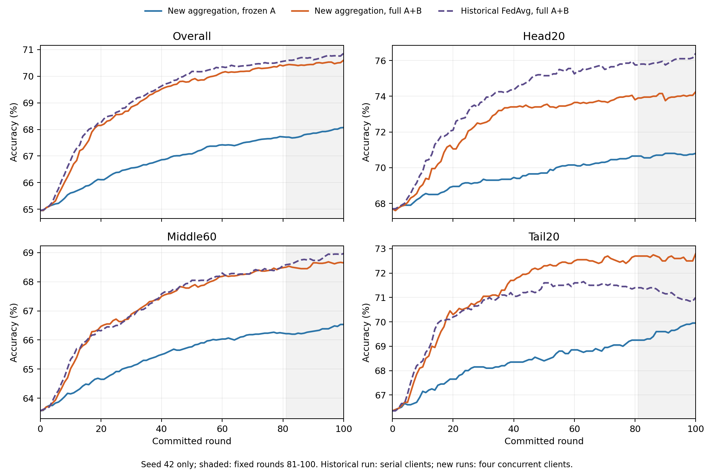

**新聚合与 A＋B：seed42 结果复核（2026-10-10）**

结论：在同一新聚合下，整套 A＋B 比永久冻结 LoRA A 有明确的描述性增益，头、中、尾三组均值都提高。相比历史 FedAvg＋A＋B，新方案呈现尾类提高、头类下降、Overall 略降的取舍。当前证据支持继续学习 A 的方向，但不足以固定现有聚合、保持修正和来源 C 的所有设计。

本文中的“方法 A”指 A 因子学习加 Full-CP 保持修正；“方法 B”指来源 C 产生的共享 B 补充更新。普通 B 因子训练不是这里的“方法 B”。

**数据及执行核验**

两条正式轨迹均完成100轮。逐样本复算202份提交模型预测和52份阶段预测，共254份、每份10000张测试图，结果与存档汇总一致。核对8700条客户端训练预算、290个聚合/并行阶段记录、样本划分、初始化、训练/测试池、客户端日程、反馈样本及配置。frozen 的101个预测元数据中 A 哈希一致；两组初始预测与间隔一致。当前本地训练源文件指纹与注册指纹一致。

压缩结果没有模型权重检查点，本次没有重新构造有效参数更新张量；重构误差、冻结因子误差及范数部分依据保存的事件审计记录。独立随机种子只有42，轮次、类别和诊断事件都不能当作独立种子。

**1．整套方法在新聚合下是否有效**

主指标统一为预先指定的第81—100轮均值，不挑最好轮次。准确率单位为%，差值单位为百分点。

| 方法 | Overall | Head20 | Middle60 | Tail20 |
|---|---:|---:|---:|---:|
| 新聚合，永久冻结 A | 67.8600 | 70.7050 | 66.3308 | 69.6025 |
| 新聚合，当前 A＋B | 70.4700 | 73.9950 | 68.5742 | 72.6325 |
| 差值 | +2.6100 | +3.2900 | +2.2433 | +3.0300 |

这说明仅调整客户端聚合权重、一直冻结 A，没有达到整套方案的表现。三组均值改善不等于每类改善：100类中63类提高、33类下降、4类不变；尾部20类中13类提高、7类下降。

当前 A 学习日程是第1—90轮每轮额外训练 A 一轮，第91—100轮不训练 A；并非这次实验已经验证了“偶尔按需解冻”。frozen 没有这些额外训练，因此这组对照没有排除单纯增加训练机会的作用。

来源 C 首次在第30轮执行。在第29轮、尚未使用来源 C 时，A＋B 分支相对冻结分支已经 Overall +2.18、Tail20 +2.70。这将早期差距定位到 A 学习及其保持修正这部分，不能将全部增益记在 C 迁移上；也不能将第29轮差距作为最终贡献比例。

**2．收益主要体现为新增学习超过额外损失**

按两组相同的第0轮预测划分“起初答对”和“起初答错”的样本，再对最后20轮取平均。下表均为 A＋B 相对 frozen 的样本数差异。

| 样本组 | 起初答错、后来答对的增加 | 起初答对、后来答错的增加 | 净增加答对 |
|---|---:|---:|---:|
| 全部10000张 | +393.50 | +132.50 | +261.00 |
| 头类2000张 | +85.45 | +19.65 | +65.80 |
| 中类6000张 | +222.95 | +88.35 | +134.60 |
| 尾类2000张 | +85.10 | +24.50 | +60.60 |

这与“长期固定 A 的学习增益不足”一致；不能据此把新增学习全部归因为 A 的特殊方向，也不能描述成“相对冻结组减少了遗忘”。“学会/遗忘”在这里指固定测试样本的答对/答错变化，不是直接测量抽象知识。

两组第100轮 Tail20 分别为69.95和72.80，均达到各自观测最高值；本次没有出现最终尾类准确率回落。样本层面的遗忘仍存在。到最后20轮，AB平均仍有头类455.10、中类1633.00、尾类482.60张测试图从未在已观察的提交轮次答对，继续学习仍有空间；这本身不能诊断为模型容量不足。

**3．新聚合相对旧聚合是什么变化**

| A＋B 的聚合版本 | Overall | Head20 | Middle60 | Tail20 |
|---|---:|---:|---:|---:|
| 历史样本量 FedAvg | 70.6965 | 75.9550 | 68.7900 | 71.1575 |
| 当前新聚合 | 70.4700 | 73.9950 | 68.5742 | 72.6325 |
| 新减旧 | −0.2265 | −1.9600 | −0.2158 | +1.4750 |

两次 AB 的7项数据/初始化/日程/反馈哈希、样本级客户端划分、训练预算、Python/PyTorch/CUDA/cuDNN及GPU型号一致。主要算法配置变化为聚合；但执行也由串行变为四客户端并行，并增加观测性阶段测试。短程数值检查通过，不能由此保证100轮完全相同的数值轨迹。因此这是可比性较好的历史对照，仍不应宣称是严格只改变聚合的一次重跑。

现有结果不支持“新聚合全面改善 A＋B”。更准确的说法是：目前获得了更高的尾类准确率，同时头类和Overall下降。若目标是提升全体类别学习，当前 lambda=0.1 尚不宜直接固定为最终方案。

旧E2的68.1010/69.6500（Overall/Tail20）也不能作为本次 frozen 的完全匹配 FedAvg 基线：E2另有9次额外B训练，共3168步，新 frozen 没有，而且记录的环境不同。历史 tailrw-g16 为70.9120/72.2775，新AB相对它 Overall −0.4420、Tail20 +0.3550；两者方法与环境也不同，不能作为聚合单因素证据。

**4．聚合改变了代表权，但尚未证明它改善了每次实际更新**

三个尾类集中客户端27—29的总聚合权重由1.1985%提高到11.4629%。按客户端类别比例混合计算的尾类质量由1.4105%变为10.7835%；头类由61.3349%变为51.6852%，中类由37.2545%变为37.5313%。这些是计数代理量，不是模型知识或梯度贡献。两个客户端5、6权重接近数值下界。

本次还保存了同一起点、同一批本地更新改用原样本量权重的未提交模型。在 AB 的8个诊断轮次，新B聚合相对原权重聚合：Head20全部下降，平均−0.14375；Overall平均−0.02250；Tail20平均−0.00625，正负各3次。frozen的相同对照平均Overall −0.01125、Tail20为0。

因此，“尾类客户端获得更多权重”已实现，但“这种权重一定给出更好的单轮尾类方向”没有被观察到。单步诊断也不能否定长期轨迹带来的尾类收益。可探索的调整应是抑制客户端权重过度集中、检查计数代理与实际类别响应的关系，而非为了给A/B留空间而故意削弱聚合。任何混合强度或下界应在训练侧验证集上确定，不在这批测试结果上反复选优。

**5．A 的保持修正是当前最值得定位的环节**

下表是预先指定诊断轮次的即时准确率变化，不是各组件的长期消融效果。

| 操作 | 事件数 | Overall | Head20 | Middle60 | Tail20 |
|---|---:|---:|---:|---:|---:|
| 普通 A 更新 | 7 | +0.0243 | −0.0143 | +0.0310 | +0.0429 |
| 随后的保持修正 | 7 | −0.0271 | +0.0143 | −0.0333 | −0.0500 |
| 来源 C 的 B 补充更新 | 6 | +0.0283 | −0.0583 | +0.0250 | +0.1250 |

保持修正在这7次测试中，Tail20为4次下降、3次不变，无正增益；第90轮普通A更新使Tail20提高0.20，修正后又下降0.20。它的平均绝对影响较小，不能把7次即时变化累加成最终损失或直接宣布保持方法无效。

参数记录提供了一条机制线索：第61—90轮，修正后有效更新范数平均约为普通A提议的39.9%；A参数更新与原提议的平均余弦为−0.112。与此同时，这30轮保持损失均降低、分类参考损失均升高。即后期修正明显改变了普通学习的方向和幅度，并在训练目标之间做取舍。范数和余弦来自保存的记录，不是本次由检查点张量重新计算。

合理假设是现有保持目标/强度与新聚合下的学习需求可能不再匹配，但现在不能证明它是长期性能不足的原因。普通A即时Head20均值也不是正值，因此不能编成“普通A每次都学好头类，保持修正专门破坏头类”的故事。

**6．当前来源 B 更像尾类补充，尚未成为全类别学习模块**

六个有官方测试阶段诊断的C事件中，Tail20有5次提高、1次下降，平均+0.125；Overall平均+0.0283，Head20平均−0.0583。全部8个实际C事件的来源并集仍是30个客户端，来源池筛选没有真正缩小。补充更新的有效范数约为当轮普通B更新的1.36—2.37倍。没有同幅度直接校准对照，因此本次不能证明收益独属于来源知识迁移，也不能推翻之前F对照的结论。

“只在尾类提供平均帮助”和“提升所有类别的学习”是两个不同目标。若B的目标转向后者，当前证据说明还需要处理头类代价与来源使用方式，继续扩大C或简单增加优化步数缺少依据。

**7．加速与成本**

正式100轮耗时：frozen 4.04小时，AB 8.73小时，AB约为2.16倍。包括测试、日志、I/O与训练侧诊断，不能全部称为纯训练开销。普通本地优化均为105600步，AB另加31680步A训练、270步保持修正与16步C优化；本地图像呈现次数增加30%。

四客户端并行的六客户端同起点试跑速度比分别为：frozen B 1.274倍、AB B 1.247倍、AB A 1.217倍。数值比较均通过，最大参数绝对误差5.73e-7；最后只有2个客户端的短组也通过。正式阶段记录显示每次30个客户端完整执行。可据此确认这次并行尝试有效且尾批可运行，不能称为4倍或完整100轮的匹配加速测量。正式记录的PyTorch峰值已分配显存约4.82/9.61 GiB，不等于nvidia-smi总占用。

**下一步用于固定方法的建议**

优先保留“需要继续学习A”的研究方向，不急于增加动态开关或扩大来源C。若下一步只补一个完整实验，建议在相同新聚合、相同A训练日程、相同共享B下，只取消A后的保持修正，普通A提议直接提交，其他设置保持一致。与现有AB比较，就能直接回答保持修正的长期收益是否值得其学习代价；它不是取消A训练，也不是同时取消C。

若去掉保持修正仍能维持尾类并改善学习，应重设保持目标/强度，而非继续包装现有强保持；若后期尾类出现退化且总体取舍较差，保持部分就有了直接的长期依据。这个对照只检验保持在当前C存在时的作用。随后若需确认来源B，再补相同新聚合下的方法A单独运行。当前计数聚合的头尾取舍需要独立处理，不能先假定让A/B必然补回来。

文件索引：[复核记录](audit.json)、[性能](performance.csv)、[历史配置核对](historical_audit.json)、[历史结果](historical_performance.csv)、[逐事件变化](stage_by_round.csv)、[共同起点样本变化](cohort_contrasts.csv)、[修正参数记录汇总](correction_diagnostics.csv)、[并行试跑](parallel_pilot.csv)、[成本](costs.csv)。

